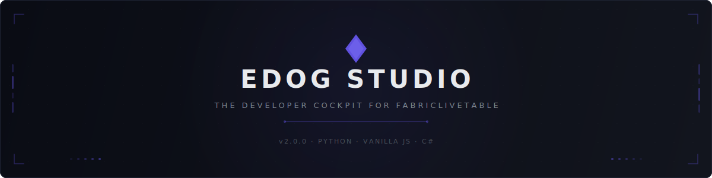
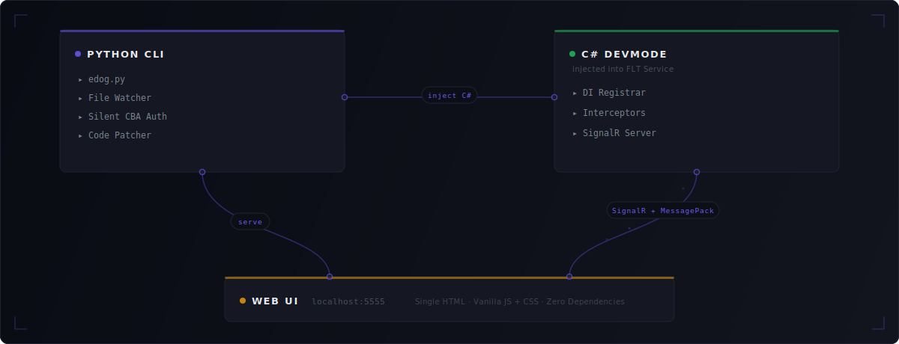

<div align="center">
<br>

<picture>
  <source media="(prefers-color-scheme: dark)" srcset="docs/assets/banner-dark.svg">
  <source media="(prefers-color-scheme: light)" srcset="docs/assets/banner-light.svg">
  
</picture>

<br>

**Browse workspaces. Deploy locally. Debug in real-time.**
<br>
**A developer cockpit on `localhost:5555`.**

<br>

[](https://python.org)
[](LICENSE)
[]()
[]()

</div>

<br>

EDOG Studio gives [FabricLiveTable](https://learn.microsoft.com/en-us/fabric/) developers a single UI to browse Fabric resources, deploy to a local lakehouse with one click, and debug with real-time logs, DAG visualization, and Spark traffic inspection. It evolved from [flt-edog-devmode](https://github.com/guptahemant65/flt-edog-devmode) into a full engineering cockpit.

---

## Two Phases, One Cockpit

<table>
<tr>
<td width="50%" valign="top">

### ○ Phase 1 — Disconnected

> No FLT service required. Just your Fabric credentials.

▸ Browse tenants, workspaces, lakehouses, tables<br>
▸ Create, rename, and delete Fabric resources<br>
▸ Manage feature flags with rollout visibility<br>
▸ Test any Fabric API in the built-in playground

</td>
<td width="50%" valign="top">

### ● Phase 2 — Connected

> Pick a lakehouse ▸ deploy ▸ full DevTools.

▸ Real-time log streaming with breakpoints<br>
▸ Interactive DAG graph with Gantt chart<br>
▸ Spark HTTP request/response inspector<br>
▸ Lock monitor with auto-unlock<br>
▸ File change detection with hot re-deploy

</td>
</tr>
</table>

---

## Views

| View | Phase | Description |
|:-----|:-----:|:------------|
| **Workspace Explorer** | Both | Browse and manage tenants, workspaces, lakehouses, tables. One-click deploy. |
| **Logs** | Connected | Streaming log viewer with breakpoints, bookmarks, and error clustering. |
| **DAG Studio** | Connected | Interactive DAG graph, Gantt execution chart, diff, run/cancel controls. |
| **Spark Inspector** | Connected | Capture every Spark and GTS HTTP request and response. |
| **API Playground** | Both | Test Fabric APIs with pre-configured endpoints and live auth. |
| **Environment** | Both | Feature flags, lock monitor, orphaned resource cleanup. |

Plus: Command Palette (<kbd>Ctrl</kbd>+<kbd>K</kbd>), Token Inspector, File Change Detection, Session History.

---

## Quick Start

```powershell
# Install
irm https://raw.githubusercontent.com/guptahemant65/edog-studio/master/scripts/install.ps1 | iex

# Configure
edog --config -u your@email.com

# Launch
edog
```

Open **http://localhost:5555** — you're in.

---

## Architecture

<picture>
  <source media="(prefers-color-scheme: dark)" srcset="docs/assets/architecture-dark.svg">
  <source media="(prefers-color-scheme: light)" srcset="docs/assets/architecture-light.svg">
  
</picture>

<br>

<details>
<summary><b>Project Structure</b></summary>
<br>

```
edog-studio/
├── src/
│   ├── frontend/          # JS + CSS modules → single HTML build
│   └── backend/           # C# DevMode injected into FLT service
├── edog.py                # CLI entrypoint
├── scripts/               # Build, install, setup automation
├── config/                # Default configuration templates
├── tests/                 # Test suite
├── docs/
│   ├── specs/             # Feature specifications
│   ├── design/            # Design bible, component library, mockups
│   └── adr/               # Architecture Decision Records
└── hivemind/              # Multi-agent orchestration layer
```

The frontend builds into a **single self-contained HTML file** — all CSS and JS inlined, zero external dependencies at runtime.

</details>

---

<details>
<summary><b>Tech Stack</b></summary>
<br>

| Layer | Technology |
|:------|:-----------|
| **CLI** | Python 3.10+ — Watchdog, Pywinauto, WebSockets |
| **Frontend** | Vanilla JS + CSS — no framework, single-file build |
| **Backend Injection** | C# — DevMode registrar, interceptors |
| **Auth** | Silent CBA via C# token-helper (certificate-based, zero browser) |
| **IPC** | SignalR with MessagePack binary protocol |

</details>

<details>
<summary><b>Development</b></summary>
<br>

```powershell
git clone https://github.com/guptahemant65/edog-studio.git
cd edog-studio
python -m venv .venv && .venv\Scripts\activate
pip install -e ".[dev]"

# Build
python scripts/build-html.py

# Quality gates
make lint      # Ruff
make test      # Pytest
make build     # Full pipeline
```

See [CONTRIBUTING.md](CONTRIBUTING.md) for the full guide.

</details>

---

<div align="center">

**Built for the FabricLiveTable team at Microsoft**

[Quick Start](#quick-start) · [Contributing](CONTRIBUTING.md) · [Changelog](CHANGELOG.md) · [License](LICENSE)

</div>
