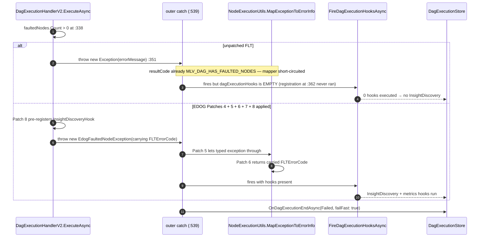
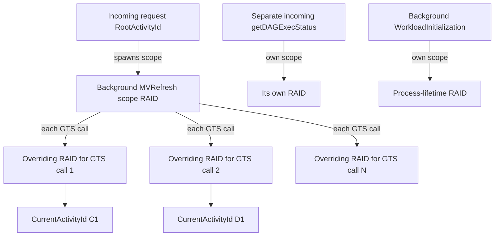

# FLT runDAG Lifecycle — Complete Reference

> Authoritative reference for the full DAG execution lifecycle in FabricLiveTable: control flow, HTTP calls, GUID propagation, hooks, events, EDOG intercept points. Every claim is cited file:line. Maintained by the EDOG Studio hivemind.
>
> Built from: 4 parallel research passes (control flow, HTTP atlas, GUID provenance, events/hooks/insights) + live evidence from an 8-minute DAG run captured on 2026-06-06 (iteration `3978f173-9eb3-4338-9901-9f799536cb5c`, lakehouse `cd654090-66b7-432a-88c9-386d8dc0c899`).
>
> All FLT line numbers are relative to `workload-fabriclivetable/Service/Microsoft.LiveTable.Service/`. All EDOG line numbers are relative to `edog-studio/`.

---

## Table of Contents

1. [Quick reference card](#1-quick-reference-card)
2. [The runDAG lifecycle — phase walk](#2-the-rundag-lifecycle--phase-walk)
   - 2.1 [Phase 1: Entry & Request Validation](#21-phase-1-entry--request-validation)
   - 2.2 [Phase 2: Reliable Operations Lifecycle](#22-phase-2-reliable-operations-lifecycle)
   - 2.3 [Phase 3: DagExecutionHandlerV2.ExecuteAsync (the heart)](#23-phase-3-dagexecutionhandlerv2executeasync-the-heart)
   - 2.4 [Phase 4: Node Execution](#24-phase-4-node-execution)
   - 2.5 [Phase 5: Hooks Lifecycle](#25-phase-5-hooks-lifecycle)
   - 2.6 [Phase 6: Terminal Status & Persistence](#26-phase-6-terminal-status--persistence)
   - 2.7 [Phase 7: Cancellation Flow](#27-phase-7-cancellation-flow)
   - 2.8 [Phase 8: Status Polling](#28-phase-8-status-polling)
   - 2.9 [Phase 9: Insights Engine](#29-phase-9-insights-engine)
   - 2.10 [Phase 10: Retry behavior across all dimensions](#210-phase-10-retry-behavior-across-all-dimensions)
3. [GUID provenance + correlation](#3-guid-provenance--correlation)
   - 3.1 [GUID inventory](#31-guid-inventory)
   - 3.2 [The Correlation Matrix](#32-the-correlation-matrix)
   - 3.3 ["Doesn't correlate" pitfall reference](#33-doesnt-correlate-pitfall-reference)
   - 3.4 [Retry-stability matrix](#34-retry-stability-matrix)
4. [HTTP call atlas](#4-http-call-atlas)
   - 4.1 [Summary table](#41-summary-table)
   - 4.2 [Per-call detail](#42-per-call-detail)
   - 4.3 [EDOG HTTP intercept analysis (the Channel 1 root cause)](#43-edog-http-intercept-analysis-the-channel-1-root-cause)
   - 4.4 [Correlation headers reference](#44-correlation-headers-reference)
   - 4.5 [Retry policy summary](#45-retry-policy-summary)
5. [Hooks + events + insights](#5-hooks--events--insights)
   - 5.1 [Hook implementations](#51-hook-implementations)
   - 5.2 [Hook execution orchestration](#52-hook-execution-orchestration)
   - 5.3 [Insight Discovery Engine](#53-insight-discovery-engine)
   - 5.4 [Event emission catalog](#54-event-emission-catalog)
   - 5.5 [Tracer surface + high-frequency emitters](#55-tracer-surface--high-frequency-emitters)
   - 5.6 [EDOG event surface](#56-edog-event-surface)
   - 5.7 [Phase × hook/event cross-reference](#57-phase--hookevent-cross-reference)
6. [EDOG patch surface](#6-edog-patch-surface)
7. [Real-world evidence (2026-06-06 live run)](#7-real-world-evidence-2026-06-06-live-run)
8. [Debugging playbook](#8-debugging-playbook)
9. [Open questions](#9-open-questions)
10. [Glossary](#10-glossary)
11. [Document maintenance](#11-document-maintenance)

---

## 1. Quick reference card

### 1.1 Lifecycle phases at a glance

| # | Phase | Entry point | What happens |
|---|-------|-------------|--------------|
| 1 | Entry & Request Validation | `Controllers\LiveTableSchedulerRunController.cs:108` | Controller accepts `POST runDAG/{iterationId}`, caches MWC token, builds `RequestContext`, hands to `LiveTableHandler` |
| 2 | Reliable Operations Lifecycle | `ReliableOperations\ReliableOperationExecutionManager.cs:111` | Registers op with platform, fire-and-forgets `ExecuteOpAsync` on the threadpool |
| 3 | `DagExecutionHandlerV2.ExecuteAsync` | `Core\V2\DagExecutionHandlerV2.cs:124` | Context regeneration/creation, DAG build, faulted-node check, topological sort, hook registration, node loop, terminal status |
| 4 | Node Execution | `Core\V2\NodeExecutor.cs:91` | Per-node Spark submission with Polly retry, polling, cancellation, node-level hooks (DQ) |
| 5 | Hooks Lifecycle | `DagExecutionHooks\DagExecutionHookExecutor.cs:29` | Phase-ordered, group-parallel hook executor; error-isolated |
| 6 | Terminal Status & Persistence | `Core\V2\DagExecutionHandlerV2.cs:521` | `OnDagExecutionEndAsync` called after hooks; single `endedAt` clock |
| 7 | Cancellation Flow | `Controllers\LiveTableSchedulerRunController.cs:397` | Controller → `CancelRunDagAsync` → `OnDagCancellationBeginAsync` → `CascadingCancellation.CancelAsync` |
| 8 | Status Polling | `Controllers\LiveTableSchedulerRunController.cs:276` | `GET getDAGExecStatus/{iterationId}` → `SchedulerRunStatus` + token-manager side-effect |
| 9 | Insights Engine | `DagExecutionHooks\Insights\Discovery\InsightDiscoveryHook.cs:75` | Runs in `HookPhase.Maintenance`; reads `NodeExecutionMetrices`, writes `_stats.json` + `{type}.json` to OneLake |
| 10 | EDOG Patch Surface | `edog-studio\edog.py:2528` | 13 patch sites (12 in `DagExecutionHandlerV2.cs` + 1 in `NodeExecutionUtils.cs`) injected by `edog.py`; canonical numbering "Patch 1–8" applies to the coupled context/faulted-throw set (see §6.1) |

### 1.2 GUID cheat sheet

| GUID | What it identifies | Stable across reliable-ops retry? | Where you'll see it |
|------|-------------------|-----------------------------------|---------------------|
| `IterationId` (= `OpId`) | One DAG iteration | YES — passed by platform | URL `/runDAG/{iterationId}`, OneLake path, `IterationId` log substring |
| `NodeId` | One DAG node definition | YES — loaded from `dag.json` | `node_{nodeId}_metrics.json`, API response |
| `TransformationId` (= `RequestId`) | One Spark statement submission attempt | CONDITIONAL — same if PUT failed, NEW if PUT succeeded then exec failed | GTS URL `/customTransformExecution/{id}`, `x-ms-workload-resource-moniker` outbound header |
| `RootActivityId` | One HTTP request scope (AsyncLocal) | NO — new on every incoming call AND every GTS outbound scope | Tracer log prefix `Category : {RAID} message`, `x-ms-root-activity-id` header |
| `SessionId` / `ReplId` | One Spark session/REPL allocation | OVERWRITTEN on retry | `DetailsPageLink` (SessionId = `activityId`), `NodeExecutionMetrics` |

### 1.3 Common debugging recipes

- **"I see X in SSR telemetry — where in the lifecycle?"** → Find the `ActivityName` (`RunDag` / `NodeExecution` / `GetDAGExecStatus`), then look up the emitter in §5.4.
- **"My EDOG error simulator rule didn't fire for `customTransformExecution`"** → It will never fire. `gtsHttpClient` bypasses `IHttpClientFactory`, so `EdogHttpPipelineHandler` is never inserted into the chain. See §4.3. Inject at the `ISparkClient` boundary (`EdogSparkClientWrapper`) instead.
- **"I have an `IterationId` — how do I find all its logs?"** → You can't grep by a single GUID. Only ~4.3% of log lines contain it (§7). You must grep the IterationId string AND walk through multiple unrelated `RootActivityId`s. See §8.3.
- **"`InsightDiscoveryHook` didn't run when DAG faulted"** → Without EDOG Patch 8, the hook registration block at `:362` is never reached on the faulted-node throw path. See §2.9, §6.
- **"Cancel returned but DAG kept running"** → Cancel uses `checkOnlyInCache: true`. Cancel requests MUST reach the same VM as the running DAG. There is no cross-VM cancellation. See §2.7.

---
## 2. The runDAG lifecycle — phase walk

### Sequence overview (happy path)

```mermaid
sequenceDiagram
    autonumber
    participant Scheduler as Platform Scheduler
    participant Ctrl as LiveTableSchedulerRunController
    participant LtH as LiveTableHandler
    participant ROM as ReliableOperationExecutionManager
    participant Handler as DagExecutionHandlerV2
    participant Node as NodeExecutor
    participant GTS as GTS / Spark
    participant Hooks as DagExecutionHookExecutor
    participant Store as DagExecutionStore + OneLake

    Scheduler->>Ctrl: POST runDAG/{iterationId}
    Ctrl->>Ctrl: AsyncLocal init, MWC token, RequestContext
    Ctrl->>LtH: RegisterAndExecuteReliableOperationsAsync
    LtH->>Store: OnDagExecutionRequestAsync (create dir)
    LtH->>ROM: EnqueueExecutionIfNotQueuedAsync
    ROM-->>Ctrl: (returns; controller HTTP 202)
    ROM->>Handler: ExecuteAsync (background Task)
    Handler->>Store: GetDagExecutionInstanceAsync / CreateAndSaveDag
    Handler->>Handler: TopologicalSort, faulted-node check, register hooks
    loop per ready node (up to parallelNodeLimit)
        Handler->>Node: ExecuteNodeAsync
        Node->>GTS: PUT customTransformExecution/{transformationId}
        loop status poll
            Node->>GTS: GET customTransformExecution/{transformationId}
        end
        Node->>Store: OnNodeExecutionEndAsync
    end
    Handler->>Hooks: FireDagExecutionHooksAsync (CRUD then Maintenance)
    Hooks-->>Store: writes metrics, insights
    Handler->>Store: OnDagExecutionEndAsync(terminalStatus)
    Handler->>Store: FinishDagExecutionInstanceAsync
```

### Faulted-nodes throw path



---

### 2.1 Phase 1: Entry & Request Validation

#### Controller endpoints

| HTTP method | Route | Controller class:method | File:line |
|-------------|-------|------------------------|-----------|
| `POST` | `v1/workspaces/{workspaceId}/lakehouses/{artifactId}/liveTableSchedule/runDAG/{iterationId}` | `LiveTableSchedulerRunController.RunDagAsync` | `Controllers\LiveTableSchedulerRunController.cs:100-108` |
| `GET` | `.../liveTableSchedule/getDAGExecStatus/{iterationId}` | `LiveTableSchedulerRunController.GetDAGExecStatusAsync` | `Controllers\LiveTableSchedulerRunController.cs:267-280` |
| `DELETE` | `.../liveTableSchedule/cancelDAG/{iterationId}` | `LiveTableSchedulerRunController.CancelRunDagAsync` | `Controllers\LiveTableSchedulerRunController.cs:388-401` |

#### Authentication / middleware chain

Applied in declaration order on the controller class (`:46-58`):

1. `[AuthenticationEngine]` — service-platform authentication (`:46`)
2. `[EnableCors(PolicyName = CorsPolicies.AllowAllCorsPolicyName)]` (`:47`)
3. `[SecurityAuditContext(MWCTokenVersion.V2)]` (`:48`)
4. `[EmitSecurityAuditEventOnException]` / `[EmitSecurityAuditEventOnSuccess]` (`:49-50`)
5. `[ValidateModel]` (`:51`)
6. `[ResolveTenantIdForFabricAccessProtection]` (`:52`)
7. `[FabricTenantSingleWorkspaceItemResource(..., TenantIdSource = ContextValueSource.RequestProperties)]` (`:53-58`)
8. Per-action: `[MwcV2RequirePermissionsFilter([Permissions.ReadAll, Permissions.Execute])]` on `RunDagAsync` (`:102`); `[MwcV2RequirePermissionsFilter([Permissions.Execute])]` on `GetDAGExecStatusAsync` (`:269`) and `CancelRunDagAsync` (`:390`).

`CustomerCapacityAsyncLocalContext.Initialize(this.Request)` (`:116`) materializes the async-local context inside each handler; `tenantId` and `capacityId` are read from it at `:150-151`. The `DagUtils.GetDagExecutionMoniker(workspaceId, artifactId)` call at `:122` produces the canonical moniker used for per-resource locking.

#### Request flow into the handler

```
[POST /runDAG/{iterationId}]
  :116  CustomerCapacityAsyncLocalContext.Initialize(request)        ← async-local capacity context
  :122  moniker = DagUtils.GetDagExecutionMoniker(wsId, artifactId)
  :124  await monikerManager.BeginExecutionAsync(moniker, capacityId)  ← cross-request serialisation lock
  :148  mlvExecutionDefinitionId = ExtractMLVExecutionDefinitionId(jobRequestOptions)
          ↳ tries Variables[] first, falls back to JobPayloadJson (:501-531)
  :149  dagName = DagUtils.GetDagName(artifactId, mlvExecutionDefinitionId)
  :152  mwcToken = Request.Headers[Authorization]?.Parameter
  :154  userObjectId = HttpTokenUtils.GetUserObjectIdFromMwcTokenWorkloadClaims(mwcToken)
  :169  (callerType, scp) = HttpTokenUtils.DetermineCallerType(mwcToken)   ← "1p"/"3p"/"3p_app"
  :182  requestContext = new RequestContext { ArtifactId, WorkspaceId, OperationId=iterationId,
                          TenantId, CapacityId, DagName, MLVExecutionDefinitionId, JobInvokeType }
  :200  tokenManager.CacheToken(artifactId, iterationId, mwcToken)         ← in-memory cache; throws→rethrows
  :211  await ltHandler.RegisterAndExecuteReliableOperationsAsync(requestContext, mwcToken)
  :223  return Accepted()                                                  ← HTTP 202 to scheduler
  [catch :225] → CreateSchedulerRunStatus(Failed)
  [finally :239] → EmitTelemetryUsageEvent (status=Pending on success path)
```

Branch points in `ExtractMLVExecutionDefinitionId` (`:491-531`): `jobRequestOptions == null` → return `null`; else try `Variables` array → else try `JobPayloadJson` → else `null`. Invalid GUID → throws `ArgumentException`.

#### GUIDs established in this phase

| GUID | Source | Stored in |
|------|--------|-----------|
| `IterationId` | URL route parameter (platform-supplied) | `requestContext.OperationId`; later `metadata.OpId` (§2.2) |
| `TenantId` | `CustomerCapacityAsyncLocalContext.Value.TenantId` | `requestContext.TenantId` |
| `CapacityId` | `CustomerCapacityAsyncLocalContext.Value.CustomerCapacityObjectId` | `requestContext.CapacityId` |
| `WorkspaceId` / `LakehouseId` | URL route parameters | `requestContext.WorkspaceId/ArtifactId` |
| `UserObjectId` | Extracted from MWC token (`workloadclaims.userObjectId` or `platformclaims.principalObjectId`) | `requestContext.SubmitUserObjectId` |
| `MLVExecutionDefinitionId?` | `Variables[]` or `JobPayloadJson` body field | `requestContext.MLVExecutionDefinitionId` |
| `RootActivityId` (per request) | WCL middleware from `x-ms-root-activity-id` header | `MonitoredScope.RootActivityId` (AsyncLocal) |

See §3 for full GUID provenance. Live evidence: TenantId `4560a712-5763-44ca-bd40-82c36cc58ad0`, CapacityId `8ed3c2ec-3f3c-4db6-be5c-5130d232875b`, WorkspaceId `88167a7f-0310-411d-9ecc-c7271bfa7c97`, LakehouseId `cd654090-66b7-432a-88c9-386d8dc0c899` (§7).

#### HTTP calls in this phase

The controller itself makes no outbound HTTP calls. The `Authorization: MwcToken {...}` header on the incoming request is parsed but not exchanged here — token exchange happens lazily inside `GTSBasedSparkClient`, `NotebookApiClient`, and `PBIHttpClientFactory` later.

#### Events emitted

- `EmitTelemetryUsageEvent` in `finally` block (`:239`) — fires `RunDag` SSR with status `Pending` on success path. See §5.4 for the full SSR schema.

---

### 2.2 Phase 2: Reliable Operations Lifecycle

#### `ReliableOperationMetadata` shape

`ReliableOperations\ReliableOperationMetadata.cs:28`

| Field | Type | Source |
|-------|------|--------|
| `OpId` | `Guid` | `iterationId` from route — **identical to IterationId** |
| `OpType` | `string` | `OperationTypes.DagExecution.ToString()` |
| `CapacityId` | `Guid` | `CustomerCapacityAsyncLocalContext.Value.CustomerCapacityObjectId` |
| `Moniker` | `string` | `DagUtils.GetDagExecutionMoniker(wsId, lhId)` |
| `TenantId` | `Guid` | `CustomerCapacityAsyncLocalContext.Value.TenantId` |
| `IsRetry` | `bool` | `false` on initial request; `true` when set by `ReliableOperationRetryHandler` (`:61`) |
| `MLVExecutionDefinitionId` | `Guid?` | extracted from job request |
| `JobInvokeType` | `string?` | `"manual"` / `"scheduled"` / null |

> **Identity note**: `OpId == IterationId`. `DagExecutionHandlerV2.cs:128` — `var iterationId = metadata.OpId;`. See §3.1 inventory row 1.

#### Registration and queueing

`LiveTableHandler.RegisterAndExecuteReliableOperationsAsync` (`:514`):

```
:532  dagExecInstance = await dagExecutionStore.OnDagExecutionRequestAsync(execContext, mlvDefId)
        ← creates the execution directory BEFORE reliable-ops registration
:534  reliableOperationMetadata = new ReliableOperationMetadata(...)
:546  await reliableOperationExecutionManager.EnqueueExecutionIfNotQueuedAsync(
          reliableOperationMetadata, CancellationToken.None)
```

`EnqueueExecutionIfNotQueuedAsync` (`:111`):

1. Acquires `monikerLock` (per-moniker `Serializer<string>`) `:136`
2. Gets/creates `MonikerReliableOperationMetadata` — per-moniker in-memory dict of running ops `:138`
3. If `OpId` already in `monikerOpMetadata.Operations` → returns immediately (dedup) `:140-144`
4. If `registerReliableOperation = true` → `reliableOperationsManager.RegisterOperationAsync(...)` `:151` (platform call; throws `NonSuccessOrchestratorResponseException` on failure `:162`)
5. Calls `EnqueueAndTrackExecution(monikerOpMetadata, opMetadata)` `:183`

`EnqueueAndTrackExecution` (`:262`): calls `ExecuteOpAsync` as fire-and-forget (`opTask.DoNotWait()`) `:270`.

`ExecuteOpAsync` (`:278`):

```
:287  await using monikerManager.BeginExecutionAsync(moniker, capacityId, cts.Token)
:291  await handler.ExecuteAsync(opMetadata, cts.Token)   ← DagExecutionHandlerV2.ExecuteAsync
[catch :295] logs, does NOT rethrow — execution failures are terminal
[finally :299] TryRemoveAndUnregisterReliableOperationAsync (unregisters from platform) :303
```

#### Retry by platform

`ReliableOperationRetryHandler.CheckAndRetryOperationAsync` (`:34`):

- Called by platform retry infrastructure when it detects the operation needs replaying.
- Constructs a new `ReliableOperationMetadata` with **`retry: true`** (`:61`).
- Calls `EnqueueExecutionIfNotQueuedAsync(..., registerReliableOperation: false)` (`:64`) — skips platform re-registration.

> **Equals quirk**: `IsRetry` is NOT part of `ReliableOperationMetadata.Equals()` (`:96-103`). Two metadata objects with the same `OpId` but different `IsRetry` are considered equal — which affects the dedup `TryGetValue` in `monikerOpMetadata.Operations`. Confirm this is intentional (§9).

#### Moniker eviction cancellation

On moniker eviction, `HandleMonikerEvictionAsync` (`:60`) cancels `monikerOpMetadata.Cts` and awaits all in-flight tasks. `ExecuteAsync` receives `monikerEvictionCancellationToken` (`:124`) which is this CTS's token. This is the *only* system-level cancellation token passed to `ExecuteAsync`; user-requested cancellation goes through `CascadingCancellation` instead (Phase 7).

#### GUIDs propagated

- `OpId` (= `IterationId`) is now stored in three places: `requestContext.OperationId`, `ReliableOperationMetadata.OpId`, platform-side `reliableOperationsManager` registration.
- `Moniker` (64-char `{workspaceIdN}{lakehouseIdN}` string) is computed here and persisted in the platform's reliable-op registration.

#### HTTP calls in this phase

None. `RegisterOperationAsync` is a platform-internal call (in-process). The HTTP 202 response is sent back to the scheduler from the controller AFTER queueing succeeds — see §2.1 line `:223`.

#### Events emitted

None directly. The fire-and-forget `ExecuteOpAsync` task captures whatever AsyncLocal `RootActivityId` is active at the point of `Task.Run`-equivalent. **This is critical for understanding the "stranded RootActivityId" pitfall in §3.3.4.**

---
### 2.3 Phase 3: DagExecutionHandlerV2.ExecuteAsync (the heart)

All line numbers in this section are in `Core\V2\DagExecutionHandlerV2.cs`.

#### Outer try-block structure

```
ExecuteAsync(:124)
├─ LiveTableRunCodeMarker.RunDAG.ExecuteAsync wrapper (:126)
│   ├─ [try :144]
│   │   ├─ Context creation (:146-218)              §2.3.2
│   │   ├─ CanContinue gate (:223-237)              §2.3.3
│   │   ├─ OnDagExecutionBegin (:270)               §2.3.4
│   │   ├─ Reliable-ops restore (:286-298)          §2.3.5 (retry only)
│   │   ├─ ConcurrentDictionaries init (:301-304)   §2.3.6
│   │   ├─ SparkClient + TokenProvider (:307-325)   §2.3.7
│   │   ├─ TopologicalSort (:328)                   §2.3.8
│   │   ├─ Faulted-node pre-check (:338-352)        §2.3.9  ← Patch 4, Patch 8 sites
│   │   ├─ Cancel check before nodes (:355-359)     §2.3.10
│   │   ├─ Hook registration (:362-420)             §2.3.11
│   │   ├─ ExecuteInternalAsync (:427)              §2.4
│   │   ├─ while(true) completion poll (:432-537)   §2.3.12
│   │   └─ break when visited.Count == sorted.Count
│   ├─ [catch Exception :539]                       §2.3.13
│   └─ [finally :605]                               §2.3.14
```

#### §2.3.2 Context creation (`:146-218`)

**Retry path** (`:148`): `dagExecutionStore.RegenerateDagExecutionContextAsync(metadata, cancellationToken)` regenerates `DagExecutionContext` from persisted metadata; sets up new `MonitoredScope` with the original `RootActivityId` (the persisted `DagExecRAID` — see §3.1 inventory).

**Fresh path** (`:155-172`):
- If `MLVExecutionDefinitionId` present: `GetMLVExecutionDefinitionAsync` (`:163`) — HTTP fetch from MLV handler; 404 returns `null` (user error, handled generically)
- `DagUtils.GetDagExecutionContext(moniker, iterationId, tenantId, mlvDefinition)` (`:167`) — builds `DagExecutionContext`

Regardless of path:
- `:183` — `tokenManager.GetTokenAsync(lakehouseId, iterationId)` — fetches MWC token
- `:186` — `HttpTokenUtils.ExtractUserInfoFromMwcToken(...)` → `userObjectId`, `submitUser`
- `:197` — `DagUtils.GetDisplayNameAsync(...)` → `dagExecutionContext.DisplayName`
- `:207` — `dagExecutionStore.GetDagExecutionInstanceAsync(dagExecutionContext, addToCacheIfMissing: true)`
- `:212` — if `dagExecInstance.Dag == null`: `CreateAndSaveDagForExecutionAsync(...)` then re-fetch

**DAG creation** (`CreateAndSaveDagForExecutionAsync`, `:832`):

```
:838  currentDag = await DagUtils.GetDagFromCatalogAsync(catalogHandler, artifactMetadataService,
            workspaceId, lakehouseId, tenantId, mwcToken, mlvDefinition, false, dagExecutionContext)
:851  await dagExecutionStore.SaveDagForExecutionAsync(dagExecutionContext, currentDag)
```

Both have individual try/catch blocks that rethrow; terminal status set by outer catch.

**`DagExecRAID` capture**: When `addToCacheIfMissing: true` causes a new instance to be created, `DagExecutionStore` captures `MonitoredScope.RootActivityId` into `DagExecutionContext.RootActivityId` and persists it under metadata key `DagExecRAID` (`Persistence.Fs.Constants.DagExecutionRAIDMetadataKey`). This is the recovery anchor for reliable-ops retry.

#### §2.3.3 CanContinue gate (`:223-237`, method `:862`)

`CheckDagExecCanContinueAsync` returns `(canContinue, activityStatus?, resultCode?)`:

1. **Already terminal** (`:870`): `dagExecInstance.DagExecutionMetrics.IsInTerminalStatus()` → `canContinue = false`, activity status from telemetry utils
2. **Lock acquisition** (`:885`): `dagExecutionStore.TryLockDagTypeForExecutionAsync(dagExecutionContext)`
   - If `false` (another iteration holds the lock):
     - If status is `Cancelling` (`:898`): logs warning, `canContinue = false` (no terminal state set — known open issue, AB tracked)
     - Else (`:904`): `dagExecInstance.OnDagExecutionSkipAsync()` → `canContinue = false`, `activityStatus = Interrupted`, `resultCode = DAG_EXECUTION_SKIPPED`

If `canContinue = false`, `ExecuteAsync` returns early at `:236`.

#### §2.3.4 OnDagExecutionBegin (`:246-281`)

Only called when `status == NotStarted` (not a retry):

```
:251  dagSettings = await RetrieveDagSettingsAsync(dagExecutionContext, mwcToken)
        ← fetches lakehouse-level settings, merges MLVExecutionDefinition overrides (:802-829)
        [catch ArgumentException :257] resultCode = MLV_SETTINGS_FORMAT_ERROR, rethrow
        [catch Exception :263] resultCode = MLV_SETTINGS_RETRIEVAL_ERROR, rethrow
:270  await dagExecInstance.OnDagExecutionBeginAsync(
          dagSettings.Environment.EnvironmentId,
          dagSettings.RefreshMode,
          ResolveParallelNodeLimit(dagSettings, ...),     ← resolver chain (:1166-1243)
          dagExecutionContext.MLVDefinition.DqScheduleSettings,
          dagExecutionContext.MLVDefinition.LastDqRunTime,
          attachedEnvironmentWorkspaceId)
```

**ParallelNodeLimit resolver chain** (`:1166-1243`). First non-null wins:
1. `ResolveFromUserDagSettings` — user explicit setting ≠ default (5) `:1178`
2. `ResolveFromFeatureFlag` — checks `FLTParallelNodeLimit20` → `FLTParallelNodeLimit15` → `FLTParallelNodeLimit10` `:1199`
3. Fallback: `defaultParallelNodeLimit` (host parameter) `:1243`

#### §2.3.8 Topological sort and pre-visited nodes (`:328-334`)

```csharp
// :328
var sortedNodes = DagUtils.PerformTopologicalSort(dag);
// :331-334
sortedNodes
    .Where(n => (!n.IsExecutable() || IsExecutableNodeFinishedExecution(dagExecInstance, n)))
    .ToList()
    .ForEach(n => visited.TryAdd(n.NodeId, false));
```

Non-executable nodes (view-only, etc.) and nodes already in terminal status (e.g., from a prior retry) are pre-added to `visited`. This is how the retry path avoids re-executing completed nodes.

#### §2.3.9 Faulted-node pre-check (`:338-352`) — Patch 4 + Patch 8 site

```csharp
// :336-337
var faultedNodes = sortedNodes.Where(n => n.IsFaulted).ToList();
if (faultedNodes.Count > 0)
{
    // :341-344
    var faultedDetails = string.Join("; ", faultedNodes.Select(n => $"{n.Name}: {n.ErrorMessage ?? ...}"));
    errorMessage = ErrorRegistry.GetErrorMessage(MLV_DAG_HAS_FAULTED_NODES, ...);
    // :348
    resultCode = ErrorCode.MLV_DAG_HAS_FAULTED_NODES.ToString();
    activityStatus = StandardizedActivityStatus.SucceededWithErrors;
    errorSource = ErrorSource.User;
    // :351 — EDOG Patch 4 swaps this for: throw new EdogFaultedNodeException(...)
    throw new Exception(errorMessage);
}
```

- **Without EDOG patches**: `resultCode` is pre-set before throw → outer catch's `if (string.IsNullOrEmpty(resultCode))` guard short-circuits; all per-node error codes collapse to `MLV_DAG_HAS_FAULTED_NODES`.
- **With Patch 4**: bare `throw new Exception(...)` is replaced by `throw new EdogFaultedNodeException(faultedNodes[0].FLTErrorCode ?? MLV_DAG_HAS_FAULTED_NODES, ...)` carrying the first faulted node's specific error code.
- **With Patch 8** (anchored on Patch 4's typed-throw comment): Immediately BEFORE the typed throw, a pre-registration block injects `InsightDiscoveryHook` into `dagExecutionHooks` (if `insightsEngineEnabled` and not already present). Without Patch 8, `dagExecutionHooks` is empty at throw-time (the normal registration block at `:362` runs AFTER this branch), so the outer-catch safety net at `:586` silently skips `InsightDiscoveryHook` for all faulted-node failures. See §2.9 and §6.3.

#### §2.3.11 Hook registration (`:362-420`)

Four feature-flag-gated hook groups registered in order:

| Feature flag | Hooks added | Line |
|---|---|---|
| `FLTDqMetricsBatchWrite` | `DqMetricsBatchWriteHook` | `:362-369` |
| `FLTTableMaintenanceHook` | `TableMaintenanceHook(maintenanceFactory, tokenManager)` | `:371-379` |
| `FLTInsightsMetrics` | `InsightsTableCreationHook` ×3 + `InsightsMetricsDataWriteHook` ×2 (RunMetrics + NodeMetrics); `InsightsTableCreationHook` for ErrorMetrics (write hook added later only if nodes fail) | `:381-406` |
| `FLTInsightsEngine` | `InsightDiscoveryHook([ConsecutiveFailuresRule, DurationRegressionRule])` | `:409-417` |

The `ErrorMetricsDataWriteHook` is registered **lazily** at `:492-495` (only when `!failed.IsEmpty && insightsMetricsEnabled`), just before hooks fire.

`:419-420` logs all registered hooks by name.

**EDOG `apply_dag_execution_hook_patch`** (edog.py `:2071`): Injected into this block. Adds `dagExecutionHooks.Add(new EdogDagExecutionHook(...))` unconditionally (no feature flag). The hook appears in live logs as `EdogObservability` in group `edog-observability` (§5.1.6).

#### §2.3.12 ExecuteInternalAsync and the completion poll (`:427-537`)

```
:427  await ExecuteInternalAsync(sparkClient, dagExecInstance, sortedNodes,
              visiting, visited, failed, metadata, dagCancellation)
:429  delayTimeToCheckNodesForExecution = parametersProvider.GetHostParameter<TimeSpan>(...)
:430  maxDagExecutionTime = parametersProvider.GetHostParameter<TimeSpan>(...)

while(true) :432
{
    if (visited.Count == sortedNodes.Count)   // all nodes processed
    {
        :436-488  compute terminalStatus (Cancelled / Completed / Failed)
        :492-495  add ErrorMetricsDataWriteHook if failures exist
        :497-516  FireDagExecutionHooksAsync(...)
        :521-526  await dagExecInstance.OnDagExecutionEndAsync(terminalStatus, ...)
        :528      break
    }
    else if (timeout OR Cancelling) && !cancelled  :530
    {
        await dagCancellation.CancelAsync()   // triggers all node CTS
    }
    :536  await Task.Delay(delayTimeToCheckNodesForExecution)
}
```

**Terminal status computation (`:436-488`):**
- `failed.IsEmpty && dagCancellation.IsCancelled` → `Cancelled`, `activityStatus = Cancelled`
- `failed.IsEmpty && !IsCancelled` → `Completed`, `activityStatus = Succeeded`
- `!failed.IsEmpty` → `Failed`; calls `ComputeDagLevelErrorFromFailedNodes` (`:697`) which iterates `failed` ConcurrentBag (unordered), prioritises `System` errors over `User` errors

#### §2.3.13 Outer catch (`:539-603`) — Patch 5, 6, 7 site

```csharp
catch (Exception e)
{
    // :544-562  error info resolution:
    if (string.IsNullOrEmpty(resultCode))        // NOT pre-set → run mapper
        (mappedErrorCode, errorMessage, activityStatus) = NodeExecutionUtils.MapExceptionToErrorInfo(e)
    else if (string.IsNullOrEmpty(errorMessage)) // resultCode pre-set but no message
        errorMessage = ErrorRegistry.GetErrorMessage(parsedErrorCode)

    // :564-577  null-guard on dagExecInstance (re-fetch if needed)

    // :579-598  if NOT already terminal:
    //   :582  endedAt = DateTime.UtcNow
    //   :586-592  FireDagExecutionHooksAsync (safety net — fires hooks on error path too)
    //   :597  await dagExecInstance.OnDagExecutionEndAsync(Failed, failFast: true, ...)
}
```

- **Patch 5** extends the guard at `:544` to also let `EdogFaultedNodeException` through the mapper: `if (string.IsNullOrEmpty(resultCode) || e is EdogFaultedNodeException)`. Without Patch 5, the pre-set `resultCode` at `:348` short-circuits the mapper and per-node codes are lost.
- **Patch 6** adds a top-of-mapper branch in `NodeExecutionUtils.cs` that recognises `EdogFaultedNodeException` and returns its carried `FLTErrorCode`.
- **Patch 7** adds a branch in the outer catch that propagates `EdogFaultedNodeException.ErrorSource` into `errorSource` (so `SucceededWithErrors` vs `Failed` is set correctly).

#### §2.3.14 Finally block (`:605-658`) — Patch 3 site

```
[try :610]
│   :613-627  add ErrorCode, ErrorMessage, FinalDagStatus to CodeMarker telemetry
│   :639      EmitDAGExecutionUsageEvent(...) — SSR + additional telemetry
│   :643      checkDagNodesToExecuteLocks.TryRemove(iterationId)
│   :649      await dagExecutionStore.FinishDagExecutionInstanceAsync(...)
[finally :652]
│   :654      sparkClient?.Dispose()
│   :655      tokenProvider?.Dispose()
│   :656      monitoredScopeForReliableOpsRetryRequest?.Dispose()
```

**EDOG Patch 3** (`apply_request_context_end_patch`, edog.py `:2691`) injects `EdogRequestContext.End(iterationId)` into this finally block.

#### HTTP calls in Phase 3

- `RetrieveDagSettingsAsync` (`:251`) — calls lakehouse-level settings handler (likely HTTP via the same FLT controller infrastructure)
- `GetMLVExecutionDefinitionAsync` (`:163`) — HTTP fetch from MLV handler
- `DagUtils.GetDagFromCatalogAsync` (`:838`) — catalog metadata read (DLS SDK calls via `DatalakeDirectoryClient`, §4.2 Cat D)
- OneLake reads/writes for `_dag.json` and metadata (§4.2 Cat D)
- Notebook content fetch via `NotebookApiClient` (§4.2 Cat B) — at DAG build time

#### Events in Phase 3

- `[DagHook] Registered N hooks: [...]` log line at `:419-420` (Message)
- `EmitDAGExecutionUsageEvent` (`:639`) — emits `RunDag` SSR with terminal status (§5.4.1)
- `OnDagExecutionBeginAsync`, `OnDagExecutionEndAsync`, `OnDagExecutionSkipAsync` — internal state transitions (no direct telemetry, but feed `DagExecutionMetrics.Status`)

---
### 2.4 Phase 4: Node Execution

#### `ExecuteInternalAsync` — the scheduling loop (`:924-1069`)

`ExecuteInternalAsync` is called once initially, then **re-enters itself recursively** from each node's `finally` block (`:1059`) — this is how newly-unblocked nodes get scheduled after a predecessor completes.

```
:937  using (await checkDagNodesToExecuteLocks.GetOrAdd(iterationId, _ => new AsyncLock()).LockAsync())
{
    foreach (var node in sortedNodes)
    {
        if (!visited && !visiting)
        {
            // :943  check all parents:
            //   parent Visited + Failed/Skipped → visited.TryAdd(node, false); OnNodeExecutionSkipAsync; skip
            //   parent Visited + Cancelled → visited.TryAdd(node, true); skip (cascade cancel)
            //   parent anyAncestorCancelled → visited.TryAdd(node, true); skip
            //   parent not yet visited → skip (not ready)

            // :981  if parentsProcessedSuccessfully && visiting.Count < parallelNodeLimit:
            //   nodesToProcess.Add(node); visiting.TryAdd(node.NodeId, node.NodeId)
        }
    }
}

foreach (var node in nodesToProcess)  :997
{
    _ = Task.Run(async () =>           // fire-and-forget inside threadpool
    {
        try :1001
        {
            :1004  var cts = await cascadingCancellation.AddOrGetAsync(node.NodeId)
            :1007  if (IsFileSourcedIngestionEnabled(node, dagExecInstance))
                       ExecuteFileSourcedNodeAsync(...)              // File-sourced path
                   else
                       var nodeExecutor = new NodeExecutor(...)
                       await nodeExecutor.ExecuteNodeAsync(cts.Token)   // Standard path

            :1018  currentNodeExecutionMetrics = dagExecInstance.GetNodeExecutionMetrics(node.NodeId)
            :1022  if (status == Failed) → failed.Add(node.NodeId)
        }
        catch (Exception e) :1042
        {
            :1044  if (cascadingCancellation.IsCancelled) → log only (expected)
                   else → Tracer.LogSanitizedError; failed.Add(node.NodeId)
        }
        finally :1054
        {
            :1056  visited.TryAdd(node.NodeId, false)
            :1057  visiting.TryRemove(node.NodeId)
            :1058  await cascadingCancellation.RemoveAsync(node.NodeId)
            :1059  await ExecuteInternalAsync(...)    // ← recursive re-entry
        }
    });
}
```

**EDOG `apply_node_executor_wrapper_patch`** (edog.py `:2117`): Wraps `new NodeExecutor(...)` with `EdogNodeExecutorWrapper` which subclasses `NodeExecutor`, overrides `ExecuteNodeAsync`, and intercepts pre/post node execution for error simulation.

#### `CascadingCancellation` mechanism

`Cancellation\CascadingCancellation.cs`:

```
AddOrGetAsync(nodeId) :42  — creates a CTS for the node; if already cancelled, immediately cancels it
CancelAsync() :97          — sets IsCancelled=true; cancels ALL CTSes in dictionary atomically
RemoveAsync(nodeId) :77    — removes + disposes node's CTS when node completes
Get(nodeId) :124           — throws KeyNotFoundException if not found
```

The `cancellationSemaphore` (`SemaphoreSlim(1,1)`) serialises all operations. Key invariant: if a new node is added after `CancelAsync()` has run, `AddOrGetAsync` immediately cancels the new node's CTS (`:53-56`).

#### `NodeExecutor.ExecuteNodeAsync` (`:91-315`)

```
:114  nodeExecutionMetrics = dagExecInstance.GetOrAddNodeExecutionMetrics(node.NodeId)
:115  if (nodeExecutionMetrics.IsInTerminalStatus()) → return   // idempotency guard
:121  statement = node.GetCode(refreshMode, workspaceName, lakehouseName, workspaceId)

[try :128]
│   :130  if (statement == ServiceInjectedStatement || ServiceInjectedErrorStatement)
│           → ExecuteNodeForTestAsync (EDOG test path - simulates success or throws)
│           return
│   :138  nodeExecutionRetryPolicy = retryPolicyProvider.CreateNodeExecutionRetryPolicy(...)
│   :141  transformExecutionResponse = await nodeExecutionRetryPolicy.ExecuteAsync(
│               ct => ExecuteNodeWithRetryAsync(nodeExecutionMetrics, resolver, ct), ct)
│   :146  nodeExecutionStatus = NodeExecutionUtils.GetNodeExecutionStatus(response.State)
│   :148  if (IsExecutionFailed(nodeExecutionStatus))
│   │       :163  if (IsExecutionCancelled(nodeExecutionStatus)) → OnNodeExecutionEndAsync(Cancelled)
│   │       else → OnNodeExecutionEndAsync(Failed, errorCode, errorMessage, nodeErrorDetails)
│   else
│       :185  mlvRefreshOutput = ParseAndExtractNodeExecutionResponse(...)
│       :192  hooks = GetNodeExecutionHooks()
│       :194  if (hooks.Count > 0)
│       │       :203  CancelNodeWithRetriesAsync(reqId, false)   // release REPL before hooks
│       │       :211  hookResult = await ExecuteNodeHooksAsync(hooks, ct)
│       │       :212  if (!hookResult.Success) → OnNodeExecutionEndAsync(Failed, hookResult.ErrorCode, ...)
│       else → OnNodeExecutionEndAsync(nodeExecutionStatus, mlvRefreshOutput)
[catch Exception :229]
│   :231  if (ct.IsCancellationRequested)
│           → OnNodeExecutionEndAsync(Cancelled); featureUsageEventActivityStatus = Cancelled
│   else → OnNodeExecutionEndAsync(Failed, ex.Message); rethrow
[finally :251]
    :258  CancelNodeWithRetriesAsync(reqId, false)    // REPL cleanup
    :268  add retry metrics to featureUsageEventMetadata
    :305  EmitNodeExecutionUsageEvent(...)
```

#### Node-level retry policy

The retry policy is created at `:138`: `retryPolicyProvider.CreateNodeExecutionRetryPolicy(artifactId, iterationId, node.Name, ct)`. This is an **in-process Polly policy** — it does NOT cross VM restarts (noted in comment at `:137`). Retries are for transient Spark HTTP failures.

Within `ExecuteNodeWithRetryAsync` (`:463`): `NodeExecutionPutRequestResolver` tracks whether to send a new `PUT` request or just poll. If a PUT succeeded in a previous attempt but polling fails, the node can retry the *poll* against the same `requestId`. If the PUT itself failed, the node cancels the old `requestId` and submits a new one with a fresh `reqId` (`:482-485`).

**There is NO DAG-level retry** — the reliable-ops retry mechanism re-executes the entire `ExecuteAsync`, but already-completed nodes are pre-visited (`:331-334`) and skipped.

#### `NodeExecutionPutRequestResolver` — TransformationId reuse logic

`Service\Microsoft.LiveTable.Service\Core\NodeExecutionPutRequestResolver.cs`:

| Case | Condition | Result |
|------|-----------|--------|
| 1 | First attempt, no prior RequestId | `reqId = Guid.NewGuid()` (`:103`) |
| 2 | First attempt, prior RequestId from failed PUT | `reqId = nodeExecutionMetrics.RequestId` (reuse) |
| 3 | PUT failed last time | `reqId = nodeExecutionMetrics.RequestId` (reuse same, `:113`) |
| 4 | PUT succeeded, execution failed | `reqId = Guid.NewGuid()` (NEW GUID, `:120`) |

See §3.4 for full retry-stability matrix.

#### `EdogNodeExecutorWrapper` / `EdogNodeExecutionContext`

`DevMode\EdogNodeExecutionContext.cs` (created by `edog.py`'s DEVMODE_FILES, `:94`) maintains an `AsyncLocal` per-node execution context. `EdogNodeExecutorWrapper` (`:106`) overrides `ExecuteNodeAsync` to:

1. Set `EdogNodeExecutionContext` before calling base
2. Call `EdogErrorSimEngine.ApplyPreGtsFaults` (`apply_error_sim_pre_gts_patch`, edog.py `:2248` — §6.1 row 3) after the DAG is built — injects faults into node metadata so the faulted-node check at `:338` picks them up naturally
3. Clear `EdogNodeExecutionContext` in its finally block

> **Important — pipeline mismatch**: The `EdogNodeExecutionContext` AsyncLocal is populated correctly, but it is **not consulted on the GTS HTTP path** because GTS calls bypass `EdogHttpPipelineHandler` entirely (§4.3). Per-node URL-substring fault rules on `customTransformExecution` silently miss not because the AsyncLocal is wrong but because the handler isn't in the chain.

#### HTTP calls in Phase 4

Per node, per attempt (see §4.2 for full schemas):

1. `PUT https://{capacity}.pbidedicated.windows-int.net/.../customTransformExecution/{transformationId}` — Spark statement submit (`GTSBasedSparkClient.cs:147-149`)
2. `GET https://.../customTransformExecution/{transformationId}` — status poll, repeats every `RequestWaitTimeInMillis` ms with backoff up to 30s (`GTSBasedSparkClient.cs:217-218`)
3. `DELETE https://.../customTransformExecution/{transformationId}` — cleanup at end of node, or on cancel (`GTSBasedSparkClient.cs:244-245`)

For file-sourced nodes: additional OneLake reads via `OnelakeBasedFileSystem` (§4.2 Cat D).

**EDOG intercept**: Items 1-3 BYPASS EDOG because they use the WCL-provided `gtsHttpClient`, not `IHttpClientFactory`. See §4.3 for full diagnosis.

#### GUIDs created/propagated per node

- `TransformationId` (= `RequestId`): generated per attempt. Lives in `NodeExecutionMetrics.RequestId`, the URL path component, `x-ms-workload-resource-moniker` outbound header (§3.1 inventory; §3.3.3 for the dual-meaning header pitfall).
- `SessionId`, `ReplId`: returned by GTS in the PUT response's `ComputeInfo`; written to `NodeExecutionMetrics` via `MarkExecutionBegan`. Overwritten on retry (§3.1 inventory).
- `RootActivityId` per GTS call: each GTS call creates an overriding `MonitoredScope` with a NEW Guid (live evidence: §7 shows 5 different RAIDs for 5 polls of the same TransformationId `33264cf9-...`).

#### Events in Phase 4

- `NodeExecution` SSR per node (`NodeExecutor.cs:390`, §5.4.1) — emitted at `:305` regardless of outcome
- `OnNodeExecutionBeginAsync`, `OnNodeExecutionEndAsync`, `OnNodeExecutionSkipAsync` — internal state writes
- Tracer messages: `"[IterationId {id} Node {name}] RequestId {reqId}: Current execution status State: ..."` (verbose; see live evidence §7 line 96)

---

### 2.5 Phase 5: Hooks Lifecycle

#### `IDagExecutionHook` interface

`DagExecutionHooks\IDagExecutionHook.cs:24`:

| Member | Type | Contract |
|--------|------|---------|
| `Name` | `string` | Unique, used for logging and dedup |
| `GroupId` | `string` | Hooks with same GroupId run sequentially; different GroupIds run in parallel |
| `Phase` | `HookPhase` | Default `HookPhase.CRUD = 0`; lower phases complete before higher phases begin |
| `ExecuteAsync(context, ct)` | `Task` | Must catch all exceptions internally; uncaught exceptions are caught by executor but never propagated |

#### `HookPhase` enum

`DagExecutionHooks\HookPhase.cs`:

| Value | Int | Purpose |
|-------|-----|---------|
| `CRUD` | 0 | Table create/read/update/delete operations |
| `Maintenance` | 1 | Post-CRUD operations (OPTIMIZE, VACUUM, Insight Discovery) |

#### `DagExecutionHookExecutor.ExecuteHooksAsync`

`DagExecutionHooks\DagExecutionHookExecutor.cs:29`:

```csharp
public async Task ExecuteHooksAsync(
    DagExecutionHookContext context,
    List<IDagExecutionHook> hooks,
    CancellationToken cancellationToken = default)
{
    // 1. Partition by Phase (ascending: CRUD=0, Maintenance=1)
    var phases = hooks.GroupBy(h => h.Phase).OrderBy(g => g.Key).ToList();

    foreach (var phase in phases)
    {
        // 2. Within each phase, group by GroupId
        var groups = phase.GroupBy(h => h.GroupId).Select(g => g.ToList()).ToList();

        // 3. Groups run in parallel (Task.WhenAll)
        var groupTasks = groups.Select(
            group => RunSequentialHooksAsync(group, context, cancellationToken));
        await Task.WhenAll(groupTasks);
        // 4. ALL groups in phase complete before next phase starts
    }
}
```

`RunSequentialHooksAsync` (`:66`): iterates hooks in registration order, calls `ExecuteHookSafeAsync` for each.

`ExecuteHookSafeAsync` (`:81-102`): wraps `hook.ExecuteAsync(context, ct)` in `try/catch`; exceptions are logged via `Tracer.LogSanitizedError` and **never propagated** (`:96-101`). Full error isolation per hook.

#### `DagExecutionHookContext`

`DagExecutionHooks\DagExecutionHookContext.cs:19`:

| Property | Type | Notes |
|----------|------|-------|
| `DagExecutionContext` | `DagExecutionContext` | Workspace/lakehouse/tenant/MLV definition |
| `DagExecInstance` | `DagExecutionInstance` | Full instance; **WARNING**: `DagExecutionMetrics` has stale values at hook time (status still InProgress) |
| `SparkClient` | `ISparkClient?` | Available for CRUD and Maintenance hooks |
| `TerminalInfo` | `DagTerminalInfo?` | **Use this** for accurate Status/EndedAt/ErrorCode/ErrorMessage/ErrorSource (AB#5169886) |

`DagTerminalInfo` (`:71`): snapshot captured before hooks fire with the computed terminal values.

#### Firing orchestration in `DagExecutionHandlerV2`

`FireDagExecutionHooksAsync` (`:1250`):

```csharp
var hookContext = new DagExecutionHookContext(dagExecutionContext, dagExecInstance, sparkClient, dagTerminalInfo);
await this.hookExecutor.ExecuteHooksAsync(hookContext, hooks, cancellationToken);
// [catch :1266] → logs, does NOT propagate ("Hooks failed ... Proceeding with terminal status update.")
```

Hooks are fired in **TWO places**:
1. **Happy path** (`:512`) — after `visited.Count == sortedNodes.Count`, with accurate `DagTerminalInfo`
2. **Error path** (`:591`) — in outer catch, wrapped in its own try/catch, fires if `dagExecInstance.Dag != null && dagExecutionHooks.Count > 0`

#### Hook firing order per DAG completion

```
Phase 0 (CRUD):
  Group "DqMetrics"           → DqMetricsBatchWriteHook         (sequential within group)
  Group "InsightsRunMetrics"  → InsightsTableCreationHook(RunMetrics)
                                InsightsMetricsDataWriteHook(RunMetrics)   (sequential)
  Group "InsightsNodeMetrics" → InsightsTableCreationHook(NodeMetrics)
                                InsightsMetricsDataWriteHook(NodeMetrics)  (sequential)
  Group "InsightsErrorMetrics"→ InsightsTableCreationHook(ErrorMetrics)
                              [+ InsightsMetricsDataWriteHook(ErrorMetrics) if nodes failed]
  Group "edog-observability"  → EdogObservabilityHook            (EDOG-injected, §5.1.6)
  [CRUD groups run in PARALLEL with each other]

Phase 1 (Maintenance):
  Group "TableMaintenance"    → TableMaintenanceHook     (sequential within group)
  Group "InsightDiscovery"    → InsightDiscoveryHook     (sequential within group)
  [Maintenance groups run in PARALLEL with each other]
```

**Live evidence** (`flt-runtime-error-trigger-v2.jsonl:1712`):

```
[DagHook] Executing phase CRUD: 5 groups in parallel:
  [DqMetrics(1 hooks), InsightsRunMetrics(2 hooks), InsightsNodeMetrics(2 hooks),
   InsightsErrorMetrics(1 hooks), edog-observability(1 hooks)]
```

That iteration ran 9 hooks total in CRUD phase. The Maintenance phase was not logged — `FLTInsightsEngine` and `FLTTableMaintenanceHook` were off in the edog int environment.

See §5 for full per-hook detail.

---

### 2.6 Phase 6: Terminal Status & Persistence

#### `DagExecutionStatus` enum

`DataModel\Dag\DagExecutionStatus.cs`:

| Value | Wire value | Set when |
|-------|------------|---------|
| `NotStarted` | `"notStarted"` | Initial state; `OnDagExecutionRequestAsync` |
| `Running` | `"running"` | `OnDagExecutionBeginAsync` |
| `Completed` | `"completed"` | `OnDagExecutionEndAsync(Completed)` |
| `Failed` | `"failed"` | `OnDagExecutionEndAsync(Failed)` or outer catch |
| `Cancelled` | `"cancelled"` | `OnDagExecutionEndAsync(Cancelled)` |
| `Skipped` | `"skipped"` | `OnDagExecutionSkipAsync` (lock contention) |
| `Cancelling` | `"cancelling"` | `OnDagCancellationBeginAsync` |
| `NotFound` | `"notFound"` | Status polling when instance not found |

#### `NodeExecutionStatus` enum

`DataModel\Dag\NodeExecutionStatus.cs`:

| Value | Set when |
|-------|---------|
| `None` | Default; before any execution request |
| `Running` | `OnNodeExecutionBeginAsync` |
| `Completed` | `OnNodeExecutionEndAsync(Completed)` |
| `Failed` | `OnNodeExecutionEndAsync(Failed, ...)` |
| `Cancelled` | `OnNodeExecutionEndAsync(Cancelled)` |
| `Skipped` | `OnNodeExecutionSkipAsync` (parent failed/skipped) |
| `Cancelling` | `OnNodeExecutionCancellationBeginAsync` |

#### `OnDagExecutionEndAsync`

Called at `:521` (happy path) and `:597` (error path with `failFast: true`). Both use the same `endedAt` timestamp computed before hooks fire — ensuring hooks and persistence see the same clock (AB#5169886).

The method writes to `DagExecutionInstance.DagExecutionMetrics` and then persists to the `IDagExecutionStore`. There is no separate DB write outside the store abstraction — persistence is store-backed (in-memory cache + OneLake/Fabric file system).

#### Terminal status sequence (happy path)

```
[all nodes visited]
  :500  endedAt = DateTime.UtcNow
  :509  dagTerminalInfo = new DagTerminalInfo(terminalStatus, endedAt, errorCode, errorMessage, errorSource)
  :512  FireDagExecutionHooksAsync(hooks, ..., dagTerminalInfo)   ← hooks see terminal info
  :521  dagExecInstance.OnDagExecutionEndAsync(terminalStatus, errMessage, errCode, errSource, endedAt)
  :649  dagExecutionStore.FinishDagExecutionInstanceAsync(...)    ← cleanup
```

---
### 2.7 Phase 7: Cancellation Flow

#### Controller entry point

`Controllers\LiveTableSchedulerRunController.CancelRunDagAsync` (`:397`):

```
:403  CustomerCapacityAsyncLocalContext.Initialize(request)
:406  moniker = DagUtils.GetDagExecutionMoniker(workspaceId, artifactId)
:408  await monikerManager.BeginExecutionAsync(moniker, capacityId, ct)   ← serialized with runDAG
:448  DagExecutionStatus result = await ltHandler.CancelRunDagAsync(...)
:451  return CreateSchedulerCancelStatus(..., result)    // HTTP 202 OK with SchedulerRunStatus
```

#### `LiveTableHandler.CancelRunDagAsync` (`:125`)

```
:134  dagExecutionContext = new(workspaceId, artifactId, ...)
:139-152  while (retryCount < 3 && dagExecInstance == null):
            dagExecInstance = dagExecutionStore.GetDagExecutionInstanceAsync(..., checkOnlyInCache: true)
            if found and Dag != null → break
            else → Task.Delay(1000); retryCount++

:154  if dagExecInstance == null → throw ErrorCode.MLV_LINEAGE_NOT_FOUND
:161  if dagExecInstance.Dag == null → throw ErrorCode.MLV_REFRESH_PENDING
:168  if IsInTerminalStatus() → return MappingForScheduler(status)   // idempotent
:174  if status == Cancelling → return MappingForScheduler(status)   // dedup

:182  await dagExecInstance.OnDagCancellationBeginAsync()   // sets status = Cancelling
[catch InvalidOperationException :184] → throw ErrorCode.MLV_TERMINAL_STATE
[catch Exception :190] → throw "Failed to cancel ... Maybe Retry again."
```

> **Critical limitation**: The cancel controller looks up the instance from **in-memory cache only** (`checkOnlyInCache: true`). Cancel requests MUST reach the same VM as the running DAG — there is **no cross-VM cancellation**.

#### `CascadingCancellation` propagation

After `OnDagCancellationBeginAsync` sets status to `Cancelling`, the execution loop at `:530` detects it:

```csharp
else if (...|| dagExecInstance.DagExecutionMetrics.Status == DagExecutionStatus.Cancelling) && !dagCancellation.IsCancelled
{
    await dagCancellation.CancelAsync()   // sets IsCancelled = true; cancels ALL node CTSes
}
```

`CascadingCancellation.CancelAsync` (`:97`) serialises under semaphore, cancels every CTS in the dictionary. New nodes added via `AddOrGetAsync` after this point get their CTS immediately cancelled (`:53`).

#### Per-node cancellation

`NodeExecutor.ExecuteNodeWithRetryAsync` polling loop (`:586-596`):

```csharp
do {
    if (ct.IsCancellationRequested)
    {
        if (!NodeExecutionUtils.IsTerminalState(transformExecResponse.State))
            transformExecResponse = new TransformExecutionResponse(id, TransformationState.Cancelled)
        break  // exits polling immediately — no Spark cancel call yet
    }
    ...
} while (!isTerminalState);
```

The Spark cancel call is made in `CancelNodeWithRetriesAsync` (`:436`) — called from `ExecuteNodeAsync`'s finally block (`:261`) and from node-level hooks (`:203`).

`CancelNodeWithRetriesAsync` uses exponential backoff retry (`NodeCancellationMaxRetryAttempts` parameter). Calls `sparkClient.CancelTransformAsync(transformExecutionId, node)`. Best-effort — if it fails, execution logs a warning but does not fail the cancel request.

#### Cleanup on cancel

The finally block (`:605`) still runs:
- SparkClient disposed (`:654`)
- TokenProvider disposed (`:655`)
- `FinishDagExecutionInstanceAsync` called (`:649`) — removes instance from active run tracking

No explicit partial-state recovery beyond persisting `Cancelled` status via `OnDagExecutionEndAsync`.

---

### 2.8 Phase 8: Status Polling

#### `GetDAGExecStatusAsync` (`:276`)

```
:299  CustomerCapacityAsyncLocalContext.Initialize(request)
:302  mwcToken = Request.Headers[Authorization]?.Parameter
:306  userObjectId = HttpTokenUtils.GetUserObjectIdFromMwcTokenWorkloadClaims(mwcToken)
:321  dagExecInstance = await ltHandler.GetDagExecInstanceAsync(workspaceId, artifactId, iterationId, tenantId)
:323  if (dagExecInstance != null)
│       schedulerRunStatus = SchedulerRunStatus.GetSchedulerRunStatus(dagExecInstance)
│       :329  if Name is null → Name = DagUtils.GetDagName(artifactId)   // fallback
│       :335  UpdateOrDeleteTokenInTokenManager(...)              ← TOKEN SIDE-EFFECT
│       return HTTP 200 + schedulerRunStatus
else  :346  throw "Could not find the Dag Execution..."
```

`LiveTableHandler.GetDagExecInstanceAsync` (`:90`): reads from `dagExecutionStore.GetDagExecutionInstanceAsync(dagExecutionContext)` — checks cache first, then falls back to persistence.

#### Token manager side-effect (`:555`)

`UpdateOrDeleteTokenInTokenManager`:

```
if (featureFlighter.IsEnabled(FLTTokenManagerSkipClearOnDagCompletion, ...))
    // Feature flag path: always update (defensive)
    tokenManager.UpdateCachedToken(artifactId, iterationId, mwcToken)
else
    if (DagExecutionMetrics.IsInTerminalStatus(status))
        // "Trying to delete the Token in TokenManager"
        tokenManager.DeleteCachedToken(artifactId, iterationId)
    else
        // "Trying to update the Token in TokenManager"  ← THE FAMOUS LOG LINE
        tokenManager.UpdateCachedToken(artifactId, iterationId, mwcToken)
```

The log **"Trying to update the Token in TokenManager"** fires from the `else` branch at `:581` during every `getDAGExecStatus` poll while the DAG is in a non-terminal status. This is a side-effect of status polling — the token is refreshed in-cache with each poll to prevent expiry during long-running DAGs.

#### Polling cadence

The platform scheduler (workload-lakehouse side) polls `getDAGExecStatus` — FLT does not implement a push mechanism. The frequency is controlled by the scheduler, not FLT. The `delayTimeToCheckNodesForExecution` host parameter controls FLT's internal completion-check loop, not the external polling.

Live evidence (§7): `getDAGExecStatus` appeared 207 times in 8 minutes — roughly every 2-3 seconds across multiple polling tiers.

#### Events emitted

- `GetDAGExecStatus` SSR per poll, via `EmitUsageTelemetryAttribute` on the controller action (~7-8ms typical, see §7 live samples lines 163, 275, 340, 569, 843, 923, 1403, 1668, 2004)
- Tracer messages: `"DAG Status for Iteration {id} found to be Running"` (Message)

---

### 2.9 Phase 9: Insights Engine

#### `InsightDiscoveryHook.ExecuteAsync`

`DagExecutionHooks\Insights\Discovery\InsightDiscoveryHook.cs:75`:

- **Phase**: `HookPhase.Maintenance` (`:72`) — runs AFTER all CRUD hooks
- **GroupId**: `"InsightDiscovery"` (`:69`)

Execution flow:

```
:82   if (context.TerminalInfo == null) → return   // guard: no terminal info = nothing to do
:87   fileSystem = GetFileSystem(context)
:96   enabledRuleTypes = GetEnabledRuleTypes()   // from ParameterManifest "InsightsEngineEnabledRules" (default "CF,DR")
:97   activeRules = this.rules.Where(r => enabledRuleTypes.Contains(r.Type))

// DAG-level failure (no nodes executed)
:107  if (nodeMetrics == null || Count == 0)
│       if (status == Failed) → HandleDagLevelFailureAsync(...)
│       else → log + return

// DAG failed but no specific node failed
:125  if (dagFailed && !anyNodeFailed) → HandleDagLevelFailureAsync(...)

// Per-MLV processing
:136  foreach (var kvp in nodeMetrics)
│       await ProcessMlvAsync(fileSystem, context, mlvDefinitionId, nodeMetric, ...)
│       [catch :149] logs error, continues (per-MLV isolation)
```

#### Storage layout

```
LiveTableSystem/DagExecutionMetrics/insights/{mlvDefinitionId}/_stats.json    ← rolling stats (no TTL)
LiveTableSystem/DagExecutionMetrics/insights/{mlvDefinitionId}/{type}.json    ← insight card (TTL 60d)
LiveTableSystem/DagExecutionMetrics/insights/{mlvDefinitionId}/{type}.user.json ← user state (API-written)
```

Source: `InsightDiscoveryHook.cs:29-31`.

#### Reads / writes

**Reads:**
- `context.DagExecInstance.NodeExecutionMetrices` — per-node metrics dict (keyed by MLV definition ID)
- `context.TerminalInfo` — terminal status, errorCode, errorSource
- `_stats.json` from OneLake via `ReadStatsAsync`

**Writes:**
- `_stats.json` — updated rolling stats (consecutive failures, duration history)
- `{type}.json` — insight card (upsert)
- TTL on card files: `InsightCardFilesExpiryTime` parameter, default 60 days (`:52`)

See §5.3 for full rule and stats schema detail.

#### The faulted-node problem (Patch 8)

In unpatched FLT, when a DAG fails due to faulted nodes:

1. `faultedNodes.Count > 0` at `:338` fires
2. `throw new Exception(errorMessage)` at `:351` exits the try block
3. The hook registration block at `:362` was **never reached** — `dagExecutionHooks` is empty
4. Outer catch at `:586` fires hooks but `dagExecutionHooks.Count == 0` → no hooks run
5. **`InsightDiscoveryHook` never fires for any faulted-node failure**

Patch 8 pre-registers `InsightDiscoveryHook` with dedup `dagExecutionHooks.Any(h => h.Name == "InsightDiscovery")` BEFORE the throw. See §6.3.

---

### 2.10 Phase 10: Retry behavior across all dimensions

There are three independent retry axes in the FLT lifecycle:

1. **Reliable-ops DAG retry** (`ReliableOperationRetryHandler`). Platform-driven; rebuilds `ReliableOperationMetadata` with `IsRetry=true`. Re-enters `ExecuteAsync`. Completed nodes pre-visited and skipped via `:331-334`. `IterationId` preserved; `RootActivityId` is new (incoming request) but immediately overridden with the persisted `DagExecRAID`.
2. **Node-level Polly retry** (`CreateNodeExecutionRetryPolicy` at `NodeExecutor.cs:138`). In-process only. Triggered by transient HTTP failures or `TransformationState.Unknown`. `TransformationId` reuse follows `NodeExecutionPutRequestResolver` rules (Case 3 vs Case 4 above).
3. **HTTP-level Polly retry** (per-client policies, §4.5). Transparent to the application; retries 429/5xx/430/etc. with exponential backoff + Retry-After.

See §3.4 for the full retry-stability matrix showing how each GUID behaves on each axis.

---

## 3. GUID provenance + correlation

### 3.1 GUID inventory

| GUID Class | Type | Lifetime | Generation site (one-liner) |
|---|---|---|---|
| `IterationId` / `OpId` | `Guid` | Per DAG iteration (stable across reliable-ops retry) | Passed in by platform scheduler via `runDAG/{iterationId}` URL route |
| `NodeId` | `Guid` | Per DAG node definition (stable across retries) | Created when DAG is built from catalog; stored in `Node.NodeId` |
| `TransformationId` / `RequestId` | `Guid` | Per node execution attempt (NEW on successful-PUT retry) | `Guid.NewGuid()` in `NodeExecutionPutRequestResolver.ShouldDoPutRequest()` (`:103`/`:120`) |
| `SessionId` | `Guid?` | Per Spark session allocation (from GTS response) | Returned by GTS in `ComputeInfo.SessionId` response to PUT |
| `ReplId` | `Guid?` | Per REPL slot in a Spark session (from GTS) | Returned by GTS in `ComputeInfo.ReplId` response to PUT |
| `RootActivityId` | `Guid` | Per HTTP request (new on every incoming call + each GTS outbound scope) | Set by WCL middleware from `x-ms-root-activity-id` header; overriding scope per GTS call |
| `WorkloadInitializationId` | `Guid` | Per process lifetime | Platform boot; appears as scope for `WorkloadInitialization` tracer category |
| `WorkloadInstanceGuid` | `Guid` | Per workload process instance | Platform orchestrator; not managed by FLT code |
| `TenantId` | `Guid` | Stable; from auth context | Extracted from `CustomerCapacityAsyncLocalContext.Value.TenantId` |
| `WorkspaceId` | `Guid` | Stable; from route parameter | Passed in route `workspaces/{workspaceId}`; decoded from moniker on retry |
| `LakehouseId` / `ArtifactId` | `Guid` | Stable; from route parameter | Passed in route `lakehouses/{artifactId}`; **identical value** |
| `CapacityId` | `Guid` | Stable; from MWC header | `CustomerCapacityAsyncLocalContext.Value.CustomerCapacityObjectId` |
| `VirtualServiceObjectId` | `Guid` | Per capacity routing context | From `x-ms-virtualserviceobjectid` / `x-ms-pbi-premium` header |
| `MLVExecutionDefinitionId` | `Guid?` | Per scheduled execution definition (optional) | From job request body Variables; used as `DagName` for scheduled runs |
| `UserObjectId` | `Guid` | Per request user identity | Extracted from MWC token claims |
| `InsightId` | `string` (NOT Guid) | Per insight rule+definition | Deterministic: `{type}_{mlvDefinitionId}` |
| `relatedIterationId` in InsightCard | `Guid` | Per insight write | Most recent relevant IterationId at time of generation |
| `MemoryCacheId` for DagExecutionStore | `Guid` | Per process | `new SharedMemoryCache(Guid.NewGuid().ToString())` constructor |
| `DagExecRAID` (persisted) | `Guid` (string) | Per DAG iteration, persisted | Captured from `MonitoredScope.RootActivityId` at run start, persisted in OneLake metadata |

#### Activity tree (per HTTP call scope)



All of these are *unrelated* RAIDs that happen during the same `IterationId`. See §3.3.1 for the implication.

#### Selected per-GUID detail

For full per-GUID detail (storage, propagation steps, retry behavior, log evidence) the canonical reference is `research-c-guid-provenance.md §1.1-1.19`. The most important entries are inlined here:

- **`IterationId = OpId`** (`DagExecutionHandlerV2.cs:128`): the only stable correlation key for the entire iteration. Appears in URLs, log message bodies (NOT prefixes), OneLake paths `{dagName}/{iterationId}/`, persistence metadata, and SSR `correlationId` field. Computed at `TelemetryUtils.cs:92-93` as `"{RAID}-{iterationId}"` (sync) or `"{RAID}|{iterationId}"` (async).

- **`TransformationId`**: per-attempt Spark statement ID. URL path component `/customTransformExecution/{transformationId}` (`GTSBasedSparkClient.cs:147`); echoed back as `x-ms-workload-resource-moniker` outbound header (`:908`) AND response header. Reused on PUT-failed retry (`NodeExecutionPutRequestResolver.cs:113`), new GUID on exec-failed retry (`:120`).

- **`RootActivityId`**: AsyncLocal, NOT stable across calls. Each GTS poll creates an overriding `MonitoredScope` (live evidence: §7 shows RAIDs `cb145d4e`, `0282256f`, `f3ebd430`, `32ed8d53`, `7748020a` for 5 polls of the same `33264cf9` TransformationId). `RootActivityIdCorrelationHandler` (`:41`) injects it into outbound `x-ms-root-activity-id` header on `IHttpClientFactory` clients; WCL injects it on `Get1PWorkloadHttpClientAsync` clients.

- **`DagExecRAID`** (persisted): the RootActivityId captured at the *first* `addToCacheIfMissing` call to `DagExecutionStore.GetDagExecutionInstanceAsync`. Stored in OneLake metadata under `Persistence.Fs.Constants.DagExecutionRAIDMetadataKey`. On retry, restored as the active scope at `DagExecutionHandlerV2.cs:151-152` so retry logs share the original RAID.

- **`SessionId`**: GTS-allocated, returned in `ComputeInfo.SessionId`. Used as the `activityId` in `DetailsPageLink` (`DagExecutionInstance.cs:30`) — the FLT monitoring UI deep link. Overwritten on retry (`NodeExecutionMetrics.MarkExecutionRetryAttemptBegan`).

- **`Moniker`**: 64-char concatenation `{workspaceIdN}{lakehouseIdN}` (no separator) via `DagUtils.GetDagExecutionMoniker(workspaceId, lakehouseId)` (`DagUtils.cs:140-173`). Not a Guid; cannot be `Guid.Parse`'d. Reverse via `DagUtils.ExtractWorkspaceId(moniker)` and `DagUtils.ExtractLakehouseId(moniker)`.

- **`DagName`**: `mlvExecutionDefinitionId.ToString()` if present, else `artifactId.ToString()` (`DagUtils.cs:118-131`). Determines OneLake lock-file path.

- **`x-ms-workload-resource-moniker` header has TWO meanings** depending on call direction (§3.3.3). Critical pitfall.

---
### 3.2 The Correlation Matrix

This table is the most-referenced artifact in this document. Use it to answer "given GUID X, what can I reach?"

| From GUID | To GUID | Correlation mechanism | Reliable across retries? | Visible where |
|---|---|---|---|---|
| **IterationId** | **OpId** | **Identity** — `var iterationId = metadata.OpId` (`DagExecutionHandlerV2.cs:128`) | N/A — same field | Log: `LiveTableSchedulerRunController-MVRefresh` scope; SSR telemetry |
| **IterationId** | **DagExecRAID** (persisted RootActivityId) | `DagExecutionContext.RootActivityId` field; persisted in OneLake `DagExecRAID` metadata. Recover via `dagExecutionPersistenceManager` | Yes — persisted | OneLake iteration metadata, `DagExecutionStore.cs` |
| **IterationId** | **SSR correlationId** | `TelemetryUtils.GenerateCorrelationId()` → `"{RAID}-{iterationId}"` (sync) or `"{RAID}\|{iterationId}"` (async) (`TelemetryUtils.cs:92-93`) | Yes for IterationId portion; RAID changes per call | SSR telemetry events |
| **NodeId** | **NodeExecutionMetrics** | `DagExecutionInstance.NodeExecutionMetrices[nodeId]` dict lookup | Yes | In-memory; `node_{nodeId}_metrics.json` in OneLake |
| **NodeId** | **TransformationId** | `NodeExecutionMetrics.RequestId` — the active RequestId for a given NodeId | Yes for current request, but changes on retry | `node_{nodeId}_metrics.json` |
| **NodeId** | **SessionId / ReplId** | `NodeExecutionMetrics.SessionId / ReplId` — latest session/repl for this node | Only latest (overwritten on retry) | `node_{nodeId}_metrics.json`, API response |
| **TransformationId** | **GTS request** | URL path `/customTransformExecution/{transformationId}` AND `x-ms-workload-resource-moniker` outbound header | Yes for same attempt | Log: `WorkloadClientRequest` scope; GTS server logs |
| **TransformationId** | **IterationId** | Both appear in log: `"[Artifact: X, Iteration: Y, TransformationId: Z, Node name: N]"` | Yes | Log: `LiveTableSchedulerRunController-MVRefresh` scope |
| **TransformationId** | **RootActivityId** (GTS call) | Log line: `"Sending TransformStatusGet ... with root-activity-id {RAID}"` | No — new RAID each poll | Log: `LiveTableSchedulerRunController-MVRefresh` scope |
| **SessionId** | **UI DetailsPageLink** | `/workloads/de-ds/monitor/{artifactId}/{activityId}?replid={replId}&mvname={node.Name}` where `activityId = sessionId` (`DagExecutionInstance.cs:30`) | For last attempt only | `NodeExecutionMetrics.DetailsPageLink` in API response |
| **SessionId** | **GTS/Spark monitoring** | SessionId is GTS's session identifier; cross-system join in GTS logs | Yes (for that session) | External: GTS monitoring system |
| **RootActivityId** | **All log lines in a request** | AsyncLocal; every Tracer log in the same call stack has the same RAID in the prefix | No — changes per HTTP call | All log lines format: `"Category : {RAID} message"` |
| **RootActivityId** | **GTS response header** | GTS echoes `x-ms-root-activity-id` in response — correlates FLT outbound call to GTS server log | No — new per poll | Log: `WorkloadClientRequest` response headers |
| **WorkspaceId + LakehouseId** | **Moniker** | `DagUtils.GetDagExecutionMoniker(workspaceId, lakehouseId)` → 64-char concat of N-format GUIDs (`DagUtils.cs:140-171`) | Yes | `ReliableOperationMetadata.Moniker`, platform registration |
| **MLVExecutionDefinitionId** | **DagName** | `DagUtils.GetDagName(artifactId, mlvExecutionDefinitionId)` → if mlvDefId present: use it as DagName (`DagUtils.cs:118-131`) | Yes | FS lock file path, index directory |
| **IterationId** | **OneLake path** | `{dagName}/{iterationId}/` directory structure | Yes | OneLake file system |
| **IterationId** | **InsightCard.relatedIterationId** | Direct assignment by insight discovery hook at write time | Yes (point-in-time) | Insight cards in OneLake |

---

### 3.3 "Doesn't correlate" pitfall reference

> Hemant: "in every case GUIDs are different and they will not correlate". This section is the answer.

#### 3.3.1 IterationId is NOT the RootActivityId of any individual call

**This is the most common confusion.** The log entry format is:

```
[Level]: {TracerCategory} : {RootActivityId} message body containing IterationId
```

The `{RootActivityId}` in the prefix is the RAID of that specific HTTP request. The `IterationId` appears only in the message body. They are different GUIDs with different lifetimes.

**Live evidence**: For IterationId `3978f173-9eb3-4338-9901-9f799536cb5c`, the log shows at least five different RootActivityIds in the same log window:

| RootActivityId in prefix | Context |
|---|---|
| `8c1f6346-4666-447e-a183-445c57c3b3a5` | Background DAG execution scope (MVRefresh) — the RunDAG call |
| `cb145d4e-c974-4506-9903-cfe7f0289741` | Overriding scope for GTS poll #1 |
| `b9fac8d8-110a-45ad-b05d-f00dbc077871` | Incoming `getDAGExecStatus` call #1 |
| `0282256f-8e59-4dcf-b928-d0705c48a0e1` | Overriding scope for GTS poll #2 |
| `6fcf5e77-936a-4fe5-a77c-bf9a8706fe57` | Incoming `getDAGExecStatus` call #2 |

**Code proof**: `ReliableOperationExecutionManager.EnqueueAndTrackExecution` fires the DAG execution as a background `Task` (fire-and-forget via `.DoNotWait()` — `ReliableOperationExecutionManager.cs:270`). The background thread captures whatever AsyncLocal RootActivityId exists at that moment. The subsequent incoming calls (getDAGExecStatus, etc.) are entirely separate HTTP requests with their own RAIDs.

**Implication**: To find all logs for one iteration, you CANNOT grep by a single RootActivityId. You must grep by the IterationId string AND walk through multiple unrelated RAIDs. See §8.3 for the recipe.

#### 3.3.2 GTS TransformationId vs NodeId: no direct mapping in GTS logs

GTS only knows the `TransformationId` (from the URL and `x-ms-workload-resource-moniker` header). GTS does NOT know the FLT `NodeId` GUID.

To join: FLT log message contains BOTH `"TransformationId: 33264cf9-..."` AND `"Node name: dbo.data_view"` (live evidence §7). The `NodeId` (as a GUID) is not logged by default — only `node.Name` is. To find NodeId GUID, look at `node_{nodeId}_metrics.json` in OneLake, where `RequestId == TransformationId`.

#### 3.3.3 `x-ms-workload-resource-moniker` has two completely different values

- **Incoming FLT request** (platform → FLT): `x-ms-workload-resource-moniker = cd654090-...` = the LakehouseId/ArtifactId.
- **Outbound GTS request** (FLT → GTS): `x-ms-workload-resource-moniker = 33264cf9-...` = the TransformationId.

Same header name, completely different semantics depending on call direction. Live evidence: log line 118 (incoming) vs line 86 (outbound) in `flt-runtime-error-trigger-v2.jsonl`.

#### 3.3.4 RootActivityId of the original RunDAG call is NOT preserved in background thread

`ReliableOperationExecutionManager.EnqueueAndTrackExecution` captures the DAG execution as a `Task.Run`-equivalent (fire-and-forget). The original `runDAG` HTTP request's RootActivityId is gone after the `202 Accepted` is returned. The background DAG execution thread has its own AsyncLocal RAID (whatever was active when the Task started, which may or may not match the original request's RAID).

**Mitigation**: The `DagExecRAID` is persisted in OneLake metadata. On reliable-ops retry, `DagExecutionHandlerV2.cs:151-152` restores it: `new MonitoredScope(LiveTableRunCodeMarker.RunDagCMName, dagExecutionContext.RootActivityId, MonitoredScope.RootActivityId, true, true)`. This is why the retry handler can still emit logs under the original RAID.

#### 3.3.5 `ReplId` in DetailsPageLink is NOT `x-ms-workload-resource-moniker`

The `replid` query parameter in the DetailsPageLink comes from `NodeExecutionMetrics.ReplId` (a Spark-side GUID). The `x-ms-workload-resource-moniker` on GTS calls is the `TransformationId`. Different GUIDs, different systems. Both happen to be Guids but they are completely unrelated.

#### 3.3.6 AAD CorrelationId is NOT any FLT GUID

A line like `"correlationId 8de40cf9-1bf4-4878-8598-17bf9f41037d"` (live evidence line 81) is MSAL's internal token-request correlation ID. Not related to IterationId, RAID, or TransformationId.

#### 3.3.7 Moniker string is NOT a Guid

The moniker `"04ecb9f888167a7f0310411d9eccc72788167a7f"` (example) is 64 hex chars formed by concatenating two Guid "N" format strings with NO separator. It cannot be parsed as a Guid. Use `DagUtils.ExtractWorkspaceId(moniker)` and `DagUtils.ExtractLakehouseId(moniker)` instead.

#### 3.3.8 `InsightId` is NOT a Guid

`InsightCard.InsightId` is a `string` of format `"{type}_{mlvDefinitionId}"` — e.g., `"CF_3a5f8d12-..."`. Do not attempt to `Guid.Parse()` it.

---

### 3.4 Retry-stability matrix

| GUID Class | Stable Across DAG Reliable-Ops Retry? | Stable Across Node Polly Retry? | Stable Across HTTP Polly Retry? | Notes |
|---|---|---|---|---|
| **IterationId** | YES | YES | YES | Passed in from platform; never regenerated |
| **OpId** | YES | YES | YES | Same as IterationId |
| **NodeId** | YES | YES | YES | Comes from persisted `dag.json`; structure unchanged |
| **TransformationId (RequestId)** | CONDITIONAL — reloaded from persisted `NodeExecutionMetrics.RequestId` | CONDITIONAL — NEW if PUT succeeded; SAME if PUT failed | YES | See `NodeExecutionPutRequestResolver` Case 3 vs Case 4 |
| **SessionId** | CONDITIONAL — last-known session reloaded from persistence; NEW GTS allocation on next attempt | NEW on each successful PUT (GTS allocates new session) | YES | `MarkExecutionRetryAttemptBegan` overwrites |
| **ReplId** | SAME conditions as SessionId | NEW | YES | Same as SessionId |
| **RootActivityId** | NEW (new incoming retry request) | NEW per GTS poll (overriding scope) | YES (for duration of that Polly scope) | `DagExecRAID` persists original RAID for cross-referencing |
| **DagExecRAID** | YES (persisted in OneLake) | YES | YES | Read back during retry recovery |
| **TenantId** | YES | YES | YES | Stable auth property |
| **WorkspaceId / LakehouseId / CapacityId** | YES | YES | YES | Infrastructure identifiers |
| **MLVExecutionDefinitionId** | YES | YES | YES | Stable per schedule definition |
| **UserObjectId** | UNKNOWN — not persisted for recovery; may differ if retry triggered by different SP | YES (same token in one session) | YES | Derived from MWC token; retry token may differ |
| **VirtualServiceObjectId** | LIKELY NEW (routing infrastructure) | LIKELY NEW | UNKNOWN | Platform routing; not tracked by FLT |

---

## 4. HTTP call atlas

### 4.1 Summary table

| # | Cat | Method | URL Pattern (short) | Caller file:line | Phase | Retry | EDOG-intercepted? |
|---|-----|--------|---------------------|-----------------|-------|-------|-------------------|
| 1 | A | PUT | GTS `.../customTransformExecution/{transformationId}` | `GTSBasedSparkClient.cs:149` | Node execution — submit | SparkTransformSubmit Polly + capacity-window | **NO** — WCL HttpClient |
| 2 | A | GET | GTS `.../customTransformExecution/{transformationId}` | `GTSBasedSparkClient.cs:218` | Node execution — status poll | NodeExecution Polly | **NO** — WCL HttpClient |
| 3 | A | DELETE | GTS `.../customTransformExecution/{transformationId}` | `GTSBasedSparkClient.cs:245` | Node cancel | NodeCancellation Polly | **NO** — WCL HttpClient |
| 4 | A | PUT | GTS `.../customTransformExecution/{transformationId}` (Insights schema create) | `SparkMetricsWriterUtils.cs:145` | Post-DAG hook | Standard HTTP retry | **NO** — WCL HttpClient |
| 5 | A | PUT | GTS `.../customTransformExecution/{transformationId}` (Insights table DDL) | `SparkMetricsWriterUtils.cs:145` | Post-DAG hook | Standard HTTP retry | **NO** — WCL HttpClient |
| 6 | A | PUT | GTS `.../customTransformExecution/{transformationId}` (RunMetrics write) | `SparkMetricsWriterUtils.cs:145` | Post-DAG hook (InsightsMetricsDataWriteHook) | Standard HTTP retry | **NO** — WCL HttpClient |
| 7 | A | PUT | GTS `.../customTransformExecution/{transformationId}` (NodeMetrics write) | `SparkMetricsWriterUtils.cs:145` | Post-DAG hook | Standard HTTP retry | **NO** — WCL HttpClient |
| 8 | A | PUT | GTS `.../customTransformExecution/{transformationId}` (ErrorMetrics write) | `SparkMetricsWriterUtils.cs:145` | Post-DAG hook | Standard HTTP retry | **NO** — WCL HttpClient |
| 9 | A | GET | GTS `.../customTransformExecution/{transformationId}` (Insights poll) | `SparkMetricsWriterUtils.cs:209` | Post-DAG hook | Exp backoff polling (max 15 min, max delay 30s) | **NO** — WCL HttpClient |
| 10 | A | DELETE | GTS `.../customTransformExecution/{transformationId}` (Insights cleanup) | `SparkMetricsWriterUtils.cs:268` | Post-DAG hook cleanup | NodeCancellation Polly | **NO** — WCL HttpClient |
| 11 | B | GET | Notebook `.../api/workspaces/{ws}/artifacts/{nb}/content` | `NotebookApiClient.cs:137` | DAG build (source notebook fetch) | NotebookContent Polly | **NO** — WCL HttpClient |
| 12 | C | GET | OneLake DFS `{endpoint}/{workspaceId}?directory={artifactId}/{path}&resource=filesystem` | `OneLakeRestClient.cs:138` | Pre-DAG (catalog listing) | Polly OneLake policy | **YES** |
| 13 | D | Various | Azure DLS DFS `{onelakeEndpoint}/{workspaceId}/{lakehouseId}/LiveTableSystem/...` | `OnelakeBasedFileSystem.cs:120` | DAG persistence writes/reads | Azure SDK retry + app-level Polly | **YES** (DatalakeDirectoryClient) |
| 14 | E | GET | Fabric API `/v1/workspaces/{workspaceId}/lakehouses/{lakehouseId}` | `FabricApiClient.cs:60` | DQ pre-flight | None | **YES** |
| 15 | E | GET | Fabric API `/v1/workspaces/{workspaceId}` | `FabricApiClient.cs:121` | DQ pre-flight | None | **YES** |
| 16 | E | GET | Fabric API `/v1/workspaces/{workspaceId}/semanticModels/{id}` | `FabricApiClient.cs:476` | DQ setup — exists check | None | **YES** |
| 17 | E | GET | Fabric API `/v1/workspaces/{workspaceId}/reports/{id}` | `FabricApiClient.cs:476` | DQ setup — exists check | None | **YES** |
| 18 | E | POST | Fabric API `/v1/workspaces/{workspaceId}/semanticModels` | `FabricApiClient.cs:407` | DQ setup — create | None | **YES** |
| 19 | E | POST | Fabric API `/v1/workspaces/{workspaceId}/reports` | `FabricApiClient.cs:358` | DQ setup — create | None | **YES** |
| 20 | E | POST | Fabric API `/v1/workspaces/{workspaceId}/lakehouses/{lakehouseId}/jobs/instances?jobType=TableMaintenance` | `FabricApiClient.cs:267` / `TableMaintenanceApiClient.cs:141` | Maintenance node | Manual retry loop | **YES** |
| 21 | E | GET | Fabric API `{operationLocation}` (LRO poll) | `FabricApiClient.cs:175` | DQ setup — status poll | Manual while loop | **YES** |
| 22 | E | GET | Fabric API `{operationLocation}/result` | `FabricApiClient.cs:187` | DQ setup — result fetch | None | **YES** |
| 23 | G | GET | `http://localhost:{port}/__mwc__/health/status` (PublicAPI + LiveTable + Platform) | WCL internal | Workload init | None | Unclear (pre-EDOG registration) |
| 24 | H | GET | `{workloadBaseUrl}/PublicAPI/...` | `LiveTableCommunicationClient.cs:49` | Throttling check | None | **NO** — WCL HttpClient |

---
### 4.2 Per-call detail

#### 4.2.1 GTS customTransformExecution — Submit (PUT)

- **Caller**: `GTSBasedSparkClient.cs:147-149`
- **URL template**:
  ```
  https://{capacityId}.pbidedicated.windows-int.net/webapi/capacities/{capacityId}/workloads/Lakehouse/LakehouseService/automatic/v1/workspaces/{workspaceId}/artifacts/{artifactId}/customTransformExecution/{transformationId}
  ```
- **Live log evidence** (`flt-runtime-error-trigger-v2.jsonl`):
  ```
  HTTP PUT to https://8ed3c2ec3f3c4db6be5c5130d232875b.pbidedicated.windows-int.net/webapi/capacities/8ed3c2ec-3f3c-4db6-be5c-5130d232875b/workloads/Lakehouse/LakehouseService/automatic/v1/workspaces/88167a7f-0310-411d-9ecc-c7271bfa7c97/artifacts/cd654090-66b7-432a-88c9-386d8dc0c899/customTransformExecution/7d811d28-d217-49f6-894c-470af167e1a9
  ```
- **Path variables**:
  - `{capacityId}` = `CustomerCapacityAsyncLocalContext.Value.CustomerCapacityObjectId` (appears as subdomain too)
  - `{workspaceId}` = workspace GUID at factory construction
  - `{artifactId}` = lakehouse artifact GUID
  - `{transformationId}` = per-node transformation GUID (`Guid.NewGuid()` at call site)
- **HttpClient acquisition** (`GTSBasedSparkClient.cs:119-127`):
  ```csharp
  this.gtsHttpClient = await workloadContext.WorkloadCommunicationProvider
      .Get1PWorkloadHttpClientAsync("Lakehouse", "LakehouseService", customerCapacityId, tjsAppId);
  ```
  **This does NOT call `IHttpClientFactory.CreateClient()`**, so `EdogHttpClientFactoryWrapper.CreateClient` is never invoked → `EdogHttpPipelineHandler` is never inserted → see §4.3.

- **Request headers** (set in `GetGtsHttpRequestMessageAsync`, `:906-911`):

  | Header | Value | Source |
  |--------|-------|--------|
  | `Authorization` | `MwcToken {mwcV1Token}` | OBO-exchanged AAD user token → MWC V1 |
  | `x-ms-workload-resource-moniker` | `{transformationId}` (GUID string) | `Constants.WorkloadResourceMonikerHeaderKey` |
  | `PbiPreserveAuthorizationHeader` | `true` | `Constants.PbiPreserveAuthorizationHeader` |
  | `x-ms-client-authorization` | `Bearer {s2sToken}` | S2S token FLT→GTS via `GenerateS2STokenForGTSWorkloadAsync` |
  | `x-ms-root-activity-id` | GUID | WCL-injected (from `MonitoredScope.RootActivityId`) |
  | `x-ms-parent-activity-id` | GUID | WCL-injected |
  | `x-ms-virtualserviceobjectid` | GUID | WCL-injected |
  | `x-ms-mwc-internal` | `1` | WCL-injected |
  | `x-ms-src-capacity-id` | GUID | WCL-injected |
  | `Content-Type` | `application/json; charset=utf-8` | `Constants.MediaTypeHeader` |

  **Log evidence** (confirmed present on GET; PUT headers are redacted in logs but identical pattern):
  ```
  (x-ms-workload-resource-moniker:7d811d28...; PbiPreserveAuthorizationHeader:true; x-ms-root-activity-id:d8df447c...; x-ms-parent-activity-id:34ebf2b4...; x-ms-virtualserviceobjectid:077616c8...; x-ms-mwc-internal:1; x-ms-src-capacity-id:8ed3c2ec...; Content-Type:application/json; charset=utf-8)
  ```

- **Request body** — DTO `SparkJobRequest` (`GTSBasedSparkClient.cs:844-878`):
  ```json
  {
    "type": "CustomSpark",
    "customSpark": {
      "kind": "pyspark|sql",
      "code": "<SparkSQL/PySpark code>",
      "sessionProperties": { ... },
      "defaultLakehouseContext": { ... }
    },
    "transformContext": {
      "operationName": "Materialized Lake Views Run",
      "iterationId": "<iterationId GUID>"
    },
    "transformationId": "<transformationId GUID>",
    "isolationPolicy": { "correlationKey": "<iterationId[.lakehouseId]>" }
  }
  ```

- **Response DTO** — `TransformExecutionSubmitResponse`: `state`, `computeInfo` (must be non-null), `Retriable`, `RetryAfter`, `ErrorDetails`, `ComputeInfo` (contains `SessionId`, `ReplId`).

- **Status codes** (`GTSBasedSparkClient.cs:453-528`):
  - `202 Accepted` / `200 OK` → success
  - `429 TooManyRequests` → retriable, honour `Retry-After`
  - `430` → retriable, capacity throttle (`MLV_SPARK_JOB_CAPACITY_THROTTLING`)
  - `400/409/422` with parseable GTS error body → optional user-error classification (`FLTGTSUserErrorClassification`)
  - `≥500` → retriable (`MLV_SPARK_SESSION_ACQUISITION_FAILED`)
  - `401/403/404` → not retriable

- **Retry policy** (`RetryPolicyProviderV2.cs:48-78` + `SparkTransformSubmitRetryExecutor`):
  - Two-tier: Standard HTTP + Capacity (430-specific with admission window delays)
  - Standard HTTP: `HttpMaxRetryAttempts` × `ExponentialBackoffStrategy(HttpRetryMinDelayInSeconds, HttpRetryMaxDelayInSeconds)`
  - Capacity 430: `CapacityAdmissionWindowDelaysInSeconds` default `"20,40,60,90,90,90"` → ~6 min admission window, then `CapacityExtendedDelaysInSeconds` default `"60,90"` rotating
  - Retry-After honoured on 429
  - On cancellation: `TaskCanceledException` logged as timeout, state=`Failed` with `Retriable=true`

- **Frequency**: once per DAG node per iteration (submit); status polls follow.
- **EDOG-intercepted**: **NO** (WCL HttpClient — see §4.3).

#### 4.2.2 GTS customTransformExecution — Status Poll (GET)

- **Caller**: `GTSBasedSparkClient.cs:217-218`
- **URL**: same base as PUT, same `{transformationId}`
- **Headers**: identical to PUT except no `Content-Type`
- **Live evidence**:
  ```
  HTTP GET to https://.../customTransformExecution/33264cf9-1b85-4cf4-a8c3-41e460d26e43
  (x-ms-workload-resource-moniker:33264cf9...; x-ms-root-activity-id:cb145d4e...; x-ms-parent-activity-id:650d883c...; x-ms-virtualserviceobjectid:077616c8...; x-ms-mwc-internal:1; x-ms-src-capacity-id:8ed3c2ec...)
  ```
- **Response DTO** — `TransformExecutionResponse`: `state` (Running/Succeeded/Failed/Unknown/Cancelled), `errorDetails` (`ErrorCode`, `Message`, `ErrorSource`).
- **Status codes** (`GTSBasedSparkClient.cs:719-818`):
  - `200 OK` → parse body; check `ErrorDetails`
  - `404 NotFound` → fail immediately (`CreateNotFoundResponse`)
  - `401/403/400` → `TransformationState.Failed` (not retriable)
  - `429/5xx` → `TransformationState.Unknown` with `RetryAfter`
- **Retry policy**: `CreateNodeExecutionRetryPolicy` — `NodeExecutionMaxRetryAttempts` × `ExponentialBackoffStrategy(NodeExecutionRetryMinDelayInSeconds, NodeExecutionRetryMaxDelayInSeconds)`. Polly handles `Unknown` as retriable.
- **Frequency**: polled from `NodeExecutor` every `RequestWaitTimeInMillis` ms (exp backoff up to node-exec policy max). In live log: 5 distinct polls to same `transformationId` at ~6s intervals (§7).

#### 4.2.3 GTS customTransformExecution — Cancel (DELETE)

- **Caller**: `GTSBasedSparkClient.cs:244-245`
- **URL**: same base, same `{transformationId}`
- **Headers**: same correlation set as GET/PUT
- **Response**: `TransformExecutionCancelResponse`; `state` checked for `Cancelled` or `NotFound`
- **Status codes** (`GTSBasedSparkClient.cs:258-295`):
  - `2xx` → `Cancelled`
  - `404` → treat as `Cancelled` (already deleted)
  - `429/≥500` → `Unknown` with `RetryAfter`
  - Other → `Failed` (non-retriable)
- **Retry**: `CreateNodeCancellationRetryPolicy`. `CancellationToken.None` explicitly passed (`:257`).

#### 4.2.4 GTS PUT — Insights table schema/DDL creation, RunMetrics/NodeMetrics/ErrorMetrics writes

- **Caller**: `InsightsMetricsTableManager.cs` (CreateTable/MigrateTable) and `*TableWriter.cs` → `SparkMetricsWriterUtils.SubmitSparkJobAsync` / `SubmitAndAwaitSparkJobAsync` → `ISparkClient.SendTransformRequestAsync` → `GTSBasedSparkClient.cs:145-149`
- **URL/headers**: identical to 4.2.1
- **Body**:
  - Schema creation: `spark.sql("""CREATE SCHEMA IF NOT EXISTS _mlv_system""")`
  - Table DDL: `CREATE TABLE IF NOT EXISTS _mlv_system.sys_run_metrics (...) USING DELTA PARTITIONED BY (run_date)` etc.
  - RunMetrics data write: PySpark MERGE/INSERT (1 row) to `sys_run_metrics`. Columns: `iteration_id, started_at, ended_at, duration_ms, status, refresh_mode, error_code, total_nodes, succeeded_nodes, failed_nodes, skipped_nodes, cancelled_nodes, fraction_full, fraction_incremental, fraction_no_refresh, submit_user, job_invoke_type, mlv_exec_def_id, written_at, run_date`
  - NodeMetrics data write: PySpark MERGE/INSERT (N rows) to `sys_node_metrics`. 20 columns per node: `iteration_id, node_id, started_at, ended_at, duration_ms, status, error_code, error_message, error_source, added_rows_count, dropped_rows_count, session_id, details_page_link, mlv_name, mlv_id, mlv_namespace, refresh_policy, warnings, written_at, run_date`
- **Polling**: `SubmitAndAwaitSparkJobAsync` polls to completion (max 15 min) then cancels the REPL. Fire-and-forget (`SubmitSparkJobAsync`) for some operations gated on `FLTInsightsReplCleanup`.

#### 4.2.5 Notebook Content (GET)

- **Caller**: `NotebookApiClient.cs:137`
- **URL**: `{notebookBaseUrl}/api/workspaces/{workspaceId}/artifacts/{notebookId}/content` (`NotebookApiClient.cs:270`)
- **HttpClient**: `workloadContext.WorkloadCommunicationProvider.Get1PWorkloadHttpClientAsync("Notebook", "Data", ...)` (`:87-91`) — **WCL, not `IHttpClientFactory`**.
- **Headers** (`:367-370`): `Authorization: MwcToken {mwcV1TokenWithHeader}`, `PbiPreserveAuthorizationHeader: true`, WCL correlation headers.
- **ETag handling**: response ETag from `response.Headers.ETag.Tag`; if `expectedEtag` supplied and mismatches → manual 412 (`MLV_NB_ETAG_CHANGED` → 422 to caller).
- **Response**: `NotebookContentResponse { Content: string, ETag: string }`.
- **Status codes** (`:215-259`): `412` → `MLV_NB_ETAG_CHANGED`; `404` → user error; `429/430/≥500` → retriable; `403` → `MLV_ACCESS_DENIED`.
- **Retry**: `CreateNotebookContentRetryPolicy` (`RetryPolicyProviderV2.cs:181-219`) — `HttpMaxRetryAttempts` × `ExponentialBackoffStrategy(HttpRetryMinDelayInSeconds, HttpRetryMaxDelayInSeconds)`, Retry-After honoured.
- **Frequency**: once per FML node with a Notebook source, at DAG build time.

#### 4.2.6 OneLake REST — List Directory Paths (GET)

- **Caller**: `OneLakeRestClient.cs:138`
- **URL** (`:284-285`):
  ```
  {oneLakeEndpoint}/{workspaceId}?directory={artifactId}/{path}&recursive={recursive}&resource=filesystem&getShortcutMetadata={getShortcutMetadata}[&continuation={token}]
  ```
- **HttpClient**: `IHttpClientFactory.CreateClient("OneLakeRestClient")` — chain: `SyncToAsyncBridgeHandler` → `RootActivityIdCorrelationHandler` → `FabricAccessContextHandler` → `OneLakeRequestTracingHandler` → primary handler.
- **Headers** (`:272-276`):
  - `Authorization: Bearer {userToken}`
  - `x-ms-s2s-actor-authorization: Bearer {s2sToken}`
  - `x-ms-root-activity-id` (via `RootActivityIdCorrelationHandler`)
  - FabricAccessContextHandler headers
- **Pagination**: `x-ms-continuation` response header drives `do...while` loop (`:115-201`).
- **Response**: `PathList { Paths: PathObject[] }` where `PathObject { Name, IsDirectory, IsShortcut, ... }`.
- **Retry** (`OneLakeRetryPolicyProvider.cs:56-113`): Polly `WaitAndRetryAsync`, `OneLakeMaxRetryAttempts` × `ExponentialBackoffStrategy(OneLakeRetryMinDelayInSeconds, OneLakeRetryMaxDelayInSeconds)`. Retries on `408, 429, ≥500, HttpRequestException, TaskCanceledException (non-user-cancel), TimeoutException`. Retry-After honoured.
- **EDOG-intercepted**: **YES**.

#### 4.2.7 Azure DataLake Storage SDK — File/Directory Operations

- **Caller**: `OnelakeBasedFileSystem.cs:120`
- **Methods**: `PUT` (create dir/file), `PATCH` (append), `DELETE`, `GET` (read/list/exists), `HEAD` (exists).
- **URL template** (relative to base):
  ```
  https://{oneLakeEndpoint}/{workspaceId}/{lakehouseId}/{baseDirUnderLakehouse}/{subpath}
  ```
  Live evidence: `https://onelakeedog.dfs.pbidedicated.windows-int.net/88167a7f-0310-411d-9ecc-c7271bfa7c97/cd654090-66b7-432a-88c9-386d8dc0c899/LiveTableSystem/DagExecutionMetrics`
- **Base paths**:
  - `{lakehouseId}/LiveTableSystem/DagExecutionMetrics` — DAG execution state
  - `{lakehouseId}/LiveTableSystem/MLVExecutionDefinitions` — MLV definitions
  - `{lakehouseId}/Tables` — InsightsMetricsTableManager `_delta_log` existence checks
- **HttpClient**: `IHttpClientFactory.CreateClient("DatalakeDirectoryClient")` — same handler chain as `"OneLakeRestClient"` but with `ConfigurePrimaryHttpMessageHandler(() => new HttpClientHandler { ServerCertificateCustomValidationCallback = (msg, cert, chain, err) => true })`. SDK wraps via `DataLakeClientOptions { Transport = new HttpClientTransport(httpClient) }` (`:82-117`).
- **Token**: `FMVTokenCredential` wrapping `ITokenProvider`.
- **S2S header** (conditional, `:101-103`): `x-ms-s2s-actor-authorization: Bearer {s2sToken}` only when `FLTEnableOneLakeS2STokenForPLS`.
- **Retry**: Azure Storage SDK built-in + app-level Polly `CreateRetryPolicy` (`OnelakeBasedFileSystem.IOMaxRetryAttempts`, `MinDelayBetweenIOFailRetry`, `MaxDelayBetweenIOFailRetry`).
- **EDOG-intercepted**: **YES** (via `DatalakeDirectoryClient` factory client). Azure SDK pipeline sits between EDOG and transport; URLs appear as DFS REST API calls (e.g., `PUT ...?resource=file`, `PATCH ...?action=append`).

#### 4.2.8 Fabric Public API (Cat E)

All `FabricApiClient.cs` calls share auth pattern:
- **HttpClient**: `PBIHttpClientFactory.CreateWithOriginalAadTokenAsync` → `IHttpClientFactory.CreateClient("PbiSharedApiClient")`
- **Headers** (`PBIHttpClientFactory.cs:62-67`): `Authorization: Bearer {originalAadToken}`, `PbiPreserveAuthorizationHeader: true`, `x-ms-s2s-actor-authorization: {s2sToken}`, `x-ms-root-activity-id` (via `RootActivityIdCorrelationHandler`), `FabricAccessContextHandler` headers.
- **Retry**: NONE — comment at `FabricApiClient.cs:25`: "Todo: Add RetryPolicy for the API calls." Exception thrown on non-2xx.

Calls 14-22 in the summary table are code-verified but the DQ workflow was NOT triggered in the 8-minute live run, so they are not log-confirmed (§9).

**Table Maintenance** has TWO code paths:
- `FabricApiClient.cs:267` (no retry) — original
- `TableMaintenanceApiClient.cs:141` (manual retry loop with `HttpMaxRetryAttempts` + exp backoff, Retry-After honoured)

Both POST to `/v1/workspaces/{workspaceId}/lakehouses/{lakehouseId}/jobs/instances?jobType=TableMaintenance` with body:
```json
{ "executionData": { "tableName": "...", "optimizeSettings": {...}, "vacuumSettings": {...}, "purgeDeletionVectors": bool } }
```

---
### 4.3 EDOG HTTP intercept analysis (the Channel 1 root cause)

> **Headline finding**: `customTransformExecution` rules silently miss not because of an AsyncLocal failure, but because the GTS HttpClient is never inserted into the `EdogHttpPipelineHandler` chain. This is a pipeline-not-in-chain problem.

#### 4.3.1 Pipeline handler wiring

`EdogHttpPipelineHandler` is wired into the FLT HTTP stack via a single registration point:

**`EdogDevModeRegistrar.cs:269-336` — `EnsureHttpClientFactoryWrapped()`**:

```csharp
// 1. Resolve the singleton IHttpClientFactory registered by HttpClientFactoryRegistry
var inner = WireUp.Resolve<IHttpClientFactory>();
if (inner is EdogHttpClientFactoryWrapper) { return false; /* already wrapped */ }

// 2. Wrap it
var wrapper = new EdogHttpClientFactoryWrapper(inner);
WireUp.RegisterInstance<IHttpClientFactory>(wrapper);
```

**`EdogHttpClientFactoryWrapper.CreateClient(name)`** (`EdogTokenInterceptor.cs:224-255`):

```csharp
// Simplified — see EdogTokenInterceptor.cs:224-255 for the full method (error handling,
// disposal semantics, and reflection caching omitted here for readability).
var originalClient = _inner.CreateClient(name);
// Reflects _handler field from HttpMessageInvoker
var innerHandler = s_handlerField.GetValue(originalClient) as HttpMessageHandler;
// Builds chain: EdogTokenInterceptor → EdogHttpPipelineHandler → original pipeline
var httpPipeline = new EdogHttpPipelineHandler(name) { InnerHandler = innerHandler };
var tokenInterceptor = new EdogTokenInterceptor(name) { InnerHandler = httpPipeline };
return new HttpClient(tokenInterceptor, disposeHandler: false);
```

This wrapping is called for both `RegisterTokenInterceptor()` and `RegisterHttpPipelineHandler()` at lines 242-259 and 269-286 — both delegate to the same `EnsureHttpClientFactoryWrapped()` (idempotent).

#### 4.3.2 Named HttpClient registrations

In `HttpClientFactoryRegistry.cs`:

| Named Client | Handler Chain (added by `AddCommonLakehouseHandlers`) | PrimaryHandler override | EDOG-wrapped? |
|---|---|---|---|
| `UnauthenticatedWithGeneralRetries` | `SyncToAsyncBridgeHandler` → `RootActivityIdCorrelationHandler` → `FabricAccessContextHandler` → `OneLakeRequestTracingHandler` | none | **YES** |
| `UnauthenticatedWithGeneralRetriesBypassSsl` | same | none | **YES** |
| `PbiSharedApiClient` | same | none | **YES** |
| `DatalakeDirectoryClient` | same | `HttpClientHandler { ServerCertificateCustomValidationCallback = true }` | **YES** |
| `OneLakeRestClient` | same | none | **YES** |
| `FabricApiClient` | NOT in `HttpClientFactoryRegistry`; name defined but `services.AddHttpClient("FabricApiClient")` is absent | — | **YES** (resolved via `IHttpClientFactory.CreateClient("FabricApiClient")` returns default client which is still wrapped) |

> **Note on `FabricApiClient`**: `HttpClientNames.cs:37` defines `"FabricApiClient"` but `HttpClientFactoryRegistry.cs` does NOT call `services.AddHttpClient(HttpClientNames.FabricApiClient)`. When `CreateClient("FabricApiClient")` is called, the factory returns an unregistered (default) client. Still goes through `EdogHttpClientFactoryWrapper`.

#### 4.3.3 HttpClients NOT protected by EDOG

These bypass `EdogHttpClientFactoryWrapper` entirely because they do NOT use `IHttpClientFactory`:

| Client | Source | Used for | Bypasses EDOG? |
|--------|--------|----------|---------------|
| `gtsHttpClient` | `workloadContext.WorkloadCommunicationProvider.Get1PWorkloadHttpClientAsync("Lakehouse", "LakehouseService", ...)` | ALL `customTransformExecution` PUT/GET/DELETE | **YES — BYPASSES** |
| `notebookHttpClient` | `workloadContext.WorkloadCommunicationProvider.Get1PWorkloadHttpClientAsync("Notebook", "Data", ...)` | Notebook content GET | **YES — BYPASSES** |
| WCL health check client | WCL internal (`WorkloadContextInitializer`) | localhost health probes at init | **YES — BYPASSES** |
| `LiveTableCommunicationClient` | `workloadContext.WorkloadCommunicationProvider.Get1PWorkloadHttpClientAsync(workloadId, "PublicAPI", ...)` | Throttling probe | **YES — BYPASSES** |

**Mechanism**: `WorkloadCommunicationProvider.Get1PWorkloadHttpClientAsync` is a WCL (Microsoft.MWC.Workload.Client.Library) method that constructs `HttpClient` instances internally using its own configuration, routing, and auth infrastructure. It injects WCL-layer headers (`x-ms-root-activity-id`, `x-ms-parent-activity-id`, `x-ms-virtualserviceobjectid`, `x-ms-mwc-internal`, `x-ms-src-capacity-id`) but does NOT call `IHttpClientFactory.CreateClient()`. Therefore `EdogHttpClientFactoryWrapper.CreateClient()` is never invoked.

#### 4.3.4 Why customTransformExecution rules silently miss — three interlocking facts

**Fact 1 — Wrong HttpClient pipeline**. `GTSBasedSparkClient.gtsHttpClient` is obtained from `WorkloadCommunicationProvider.Get1PWorkloadHttpClientAsync(...)` at `GTSBasedSparkClient.cs:119-123`. This WCL call does NOT go through `IHttpClientFactory`. Therefore `EdogHttpClientFactoryWrapper.CreateClient()` is **never called** for this client, and `EdogHttpPipelineHandler` is **never inserted** into this HttpClient's handler chain. Confirmed: the actual HTTP call at `GTSBasedSparkClient.cs:340`:

```csharp
return await this.gtsHttpClient.SendAsync(request, ct);
```

…uses an `HttpClient` instance whose handler chain contains only WCL-internal handlers.

**Fact 2 — AsyncLocal context present but irrelevant**. `EdogHttpFaultStore.TryMatchFault` reads `EdogNodeExecutionContext.Current` (an `AsyncLocal`) to match node-scoped rules. Even if this context is correctly populated by EDOG's patched `NodeExecutor`, it is **irrelevant** because `TryMatchFault` is called inside `EdogHttpPipelineHandler.SendAsync` — which is only invoked for `IHttpClientFactory`-created clients. Since `gtsHttpClient` never enters `EdogHttpPipelineHandler.SendAsync`, `TryMatchFault` is never even called for GTS requests, regardless of what `EdogNodeExecutionContext.Current` contains.

**Fact 3 — WCL logs visible, EDOG events absent**. The live log shows WCL's own `WorkloadClientRequest` log lines for every customTransformExecution call (e.g. `"Sending request to workload : uri ...customTransformExecution/..."`) — these are WCL-internal logs emitted by the WCL transport layer, completely separate from `EdogTopicRouter.Publish("http", ...)`. EDOG never sees these calls.

#### 4.3.5 Solution paths (diagnosis only, not implementing here)

To intercept GTS calls, EDOG must either:

1. **Subclass `GTSBasedSparkClient`** and override `SendHttpRequestAsync` (`GTSBasedSparkClient.cs:334` — `protected async virtual Task<HttpResponseMessage> SendHttpRequestAsync(...)`). This is the extension point explicitly designed for testing (`protected async virtual`). **ADR-004 aligns with this path.**

2. **Wrap `ISparkClientFactory`** with `EdogSparkSessionInterceptor` — already registered at `EdogDevModeRegistrar.cs:396-400`:
   ```csharp
   private static void RegisterSparkSessionInterceptor()
   {
       TryWrap<ISparkClientFactory>("SparkSession",
           inner => inner is EdogSparkSessionInterceptor,
           inner => new EdogSparkSessionInterceptor(inner));
   }
   ```
   The `EdogSparkClientWrapper` likely wraps `ISparkClient` to intercept at the `SendTransformRequestAsync`/`GetTransformStatusAsync`/`CancelTransformAsync` method level — this operates **above** the HTTP layer, intercepting at the semantic SparkClient API boundary rather than the raw HTTP level. This means the EDOG fault store must check at this level via `EdogSparkClientWrapper`, not via `EdogHttpPipelineHandler`.

**Bottom line**: a `customTransformExecution` URL-substring fault rule registered in `EdogHttpFaultStore._flatRules` is correct in itself; the call simply never reaches the handler that would consult the store. This is a **pipeline-not-in-chain failure**, not an AsyncLocal failure. Cross-link: §6.4 (EDOG known limitations) and §8.2 (debugging recipe).

---

### 4.4 Correlation headers reference

From live log evidence (`flt-runtime-error-trigger-v2.jsonl`):

| Header | Source | Set by | GTS calls | OneLake / PBI calls |
|--------|--------|--------|-----------|--------------------|
| `x-ms-root-activity-id` | `MonitoredScope.RootActivityId` | `RootActivityIdCorrelationHandler` (IHttpClientFactory clients); WCL injects directly for `Get1PWorkloadHttpClientAsync` clients | YES (WCL-injected) | YES (handler) |
| `x-ms-parent-activity-id` | Parent scope GUID | WCL-injected | YES | Unknown |
| `x-ms-workload-resource-moniker` | `{transformationId}` GUID | `GTSBasedSparkClient.cs:908` | YES | NO |
| `x-ms-virtualserviceobjectid` | Capacity virtual service object ID | WCL-injected | YES | NO |
| `x-ms-mwc-internal` | `"1"` | WCL-injected | YES | NO |
| `x-ms-src-capacity-id` | Customer capacity GUID | WCL-injected | YES | NO |
| `Authorization` | `MwcToken {mwcV1Token}` (GTS) or `Bearer {aadToken}` (PBI/OneLake) | `GTSBasedSparkClient.cs:907`; `PBIHttpClientFactory.cs:62`; `OneLakeRestClient.cs:272` | `MwcToken` | `Bearer` |
| `PbiPreserveAuthorizationHeader` | `"true"` | `GTSBasedSparkClient.cs:909`; `PBIHttpClientFactory.cs:63` | YES | YES (PBI only) |
| `x-ms-client-authorization` | `Bearer {s2sToken}` (S2S FLT→GTS) | `GTSBasedSparkClient.cs:911` | YES | NO |
| `x-ms-s2s-actor-authorization` | S2S token | `OneLakeRestClient.cs:276`; `PBIHttpClientFactory.cs:67` | NO | YES |
| `x-ms-fabric-s2s-access-context` | Set by `FabricAccessContextHandler` (WCL) | WCL handler in named client chain | NO (bypasses IHttpClientFactory) | YES |

> Reminder: `x-ms-workload-resource-moniker` has two completely different values depending on direction. On incoming FLT requests it's the LakehouseId. On outbound GTS calls it's the TransformationId. See §3.3.3.

---

### 4.5 Retry policy summary

| Client | Polly Policy | Trigger Conditions | Max Attempts | Delay Strategy |
|--------|-------------|-------------------|-------------|----------------|
| GTS Submit | `CreateSparkTransformSubmitRetryExecutor` (StandardHttpRetry + CapacityRetry) | Retriable=true; 429/5xx/430 | `HttpMaxRetryAttempts` (HTTP) + admission window (430) | `ExponentialBackoff(min, max)` + Retry-After; 430 admission `"20,40,60,90,90,90"` s |
| GTS Status Poll | `CreateNodeExecutionRetryPolicy` | `TransformationState.Unknown`; 429/5xx | `NodeExecutionMaxRetryAttempts` | `ExponentialBackoff` + Retry-After |
| GTS Cancel | `CreateNodeCancellationRetryPolicy` | `TransformationState.Unknown` | `NodeExecutionMaxRetryAttempts` or custom | `ExponentialBackoff` |
| Notebook Content | `CreateNotebookContentRetryPolicy` | `NotebookException.IsRetriable` (429/430/≥500) | `HttpMaxRetryAttempts` | `ExponentialBackoff` + Retry-After |
| OneLake REST | `CreateOneLakeRetryPolicy` | 408/429/≥500; `HttpRequestException`; `TaskCanceledException` (non-user) | `OneLakeMaxRetryAttempts` | `ExponentialBackoff` + Retry-After |
| Table Maintenance (`TableMaintenanceApiClient`) | Manual loop | 429/≥500 | `HttpMaxRetryAttempts` | `ExponentialBackoff` + Retry-After |
| Fabric Public API (`FabricApiClient`) | **None** | — | — | — |
| Azure DLS SDK | Azure SDK built-in | Transport-level transients | ~3 (SDK default) | SDK exponential |

---

## 5. Hooks + events + insights

### 5.1 Hook implementations

#### 5.1.1 `DqMetricsBatchWriteHook`

| Property | Value |
|---|---|
| **File:line** | `DagExecutionHooks/DqMetricsBatchWriteHook.cs:18` |
| **Phase** | `HookPhase.CRUD` |
| **Name** | `"DqMetricsBatchWrite"` |
| **GroupId** | `"DqMetrics"` |
| **Feature Flag** | `FLTDqMetricsBatchWrite` |
| **Registered at** | `DagExecutionHandlerV2.cs:368` |

Writes node-level DQ metrics to `sys_dq_metrics` lakehouse table via `DqMetricsTableWriter`. Two write modes: MERGE (dedup by `(MLVID, RefreshTimestamp, RefreshDate)`) or INSERT (append, no dedup — gated on `FLTDqMetricsBatchWriteInsert`).

**Failure handling**: `OperationCanceledException` → log warning → re-throws (propagates CT). Other `Exception` → log error → swallows.

**CodeMarker**: `LiveTableDagExecutionHooks-DqMetricsBatchWrite` (`CodeMarkers.cs:452`)

#### 5.1.2 `TableMaintenanceHook`

| Property | Value |
|---|---|
| **File:line** | `DagExecutionHooks/Maintenance/TableMaintenanceHook.cs:31` |
| **Phase** | `HookPhase.Maintenance` |
| **Name** | `"TableMaintenance"` |
| **GroupId** | `"TableMaintenance"` |
| **Feature Flag** | `FLTTableMaintenanceHook` |
| **Registered at** | `DagExecutionHandlerV2.cs:378` |

Flow:
1. Reads `_mlv_table_maintenance_last_run.marker` from OneLake
2. If `DateTime.UtcNow - entry.LastRunUtc >= 48h` → calls `ITableMaintenanceClient.RunTableMaintenanceAsync` (HTTP POST to maintenance API, §4.2 Cat E call 20)
3. Payload: `{ tableName, schemaName, optimizeSettings: { vOrder: true }, vacuumSettings: { retentionPeriod: "7.00:00:00" } }`
4. Writes updated marker JSON back to OneLake

Target tables: `{ "sys_dq_metrics": "dbo" }` (expandable).

**CodeMarker**: `TableMaintenanceHook-Execute` (`CodeMarkers.cs:510`)

#### 5.1.3 `InsightsTableCreationHook` (3 variants)

| Variant | tableName | GroupId | Feature Flag | Registered at |
|---|---|---|---|---|
| RunMetrics | `"sys_run_metrics"` | `"InsightsRunMetrics"` | `FLTInsightsMetrics` | `DagExecutionHandlerV2.cs:396` |
| NodeMetrics | `"sys_node_metrics"` | `"InsightsNodeMetrics"` | `FLTInsightsMetrics` | `DagExecutionHandlerV2.cs:400` |
| ErrorMetrics | `"sys_error_metrics"` | `"InsightsErrorMetrics"` | `FLTInsightsMetrics` | `DagExecutionHandlerV2.cs:405` |

| Property | Value |
|---|---|
| **File:line** | `DagExecutionHooks/Insights/InsightsTableCreationHook.cs:31` |
| **Phase** | `HookPhase.CRUD` |
| **Name** | `$"InsightsTableCreation-{tableName}"` |

Flow:
1. `InsightsMetricsTableManager.AreTableReadyAsync(tableName, context, ct)` — fast-path marker check
2. On miss: `EnsureTableReadyAsync` — creates `_mlv_system` schema + Delta table via PySpark
3. Writes `true/false` to `context.DagExecutionContext.State["{GroupId}-TablesReady"]` to signal downstream write hook

All exceptions caught, sets `State[TablesReadyStateKey] = false`, logs error. Never propagates.

**CodeMarkers**: `LiveTableDagExecutionHooks-{Run,Node,Error}MetricsTableCreation`.

#### 5.1.4 `InsightsMetricsDataWriteHook` (3 variants)

| Variant | tableName | GroupId | Writer | Registration |
|---|---|---|---|---|
| RunMetrics | `"sys_run_metrics"` | `"InsightsRunMetrics"` | `RunMetricsTableWriter` | Always with `FLTInsightsMetrics` (`:397`) |
| NodeMetrics | `"sys_node_metrics"` | `"InsightsNodeMetrics"` | `NodeMetricsTableWriter` | Always with `FLTInsightsMetrics` (`:401`) |
| ErrorMetrics | `"sys_error_metrics"` | `"InsightsErrorMetrics"` | `ErrorMetricsTableWriter` | **Conditional** — only when `failed.IsEmpty == false` (late at `:494`) |

| Property | Value |
|---|---|
| **File:line** | `DagExecutionHooks/Insights/InsightsMetricsDataWriteHook.cs:30` |
| **Phase** | `HookPhase.CRUD` |
| **Name** | `$"InsightsMetricsDataWrite-{tableName}"` |

Reads `context.DagExecutionContext.State["{GroupId}-TablesReady"]` to gate. Calls `writer.WriteMetricsAsync(dagExecInstance, dagExecutionContext, sparkClient, terminalInfo, ct)`.

> **Use `context.TerminalInfo`**, not `DagExecutionMetrics`, for Status/EndedAt/ErrorCode (AB#5169886).

`writer == null` is valid (Phase 2 placeholder stub); hook logs and returns. Keeps group structure intact for future implementation.

**CodeMarkers**: `LiveTableDagExecutionHooks-{Run,Node,Error}MetricsDataWrite`.

#### 5.1.5 `InsightDiscoveryHook`

| Property | Value |
|---|---|
| **File:line** | `DagExecutionHooks/Insights/Discovery/InsightDiscoveryHook.cs:35` |
| **Phase** | `HookPhase.Maintenance` |
| **Name** | `"InsightDiscovery"` |
| **GroupId** | `"InsightDiscovery"` |
| **Feature Flag** | `FLTInsightsEngine` |
| **Registered at** | `DagExecutionHandlerV2.cs:412-416` with `new IInsightRule[] { new ConsecutiveFailuresRule(), new DurationRegressionRule() }` |

See §5.3 for full discovery engine detail.

#### 5.1.6 `EdogObservabilityHook` (EDOG-injected)

**Not in service repo source.** Discovered exclusively via live log evidence:

```
flt-runtime-error-trigger-v2.jsonl:1712
[DagHook] Executing phase CRUD: 5 groups in parallel:
  [DqMetrics(1), InsightsRunMetrics(2), InsightsNodeMetrics(2),
   InsightsErrorMetrics(1), edog-observability(1)]

:1802 [DagHook] Starting hook 'EdogObservability' (group 'edog-observability') for iteration 3978f173-...
:1803 [DagHook] Hook 'EdogObservability' (group 'edog-observability') completed
      — elapsed ~3.5ms (0.8037130 → 0.8072549)
```

| Property | Value |
|---|---|
| **Name** | `"EdogObservability"` |
| **GroupId** | `"edog-observability"` |
| **Phase** | `HookPhase.CRUD` |
| **Execution time** | ~3.5ms — near-instant in int environment |
| **Registration** | Injected by EDOG layer; not present in `DagExecutionHandlerV2.cs`. Likely lives in EDOG overlay repo. |

> The class file for `EdogObservabilityHook` is not in `workload-fabriclivetable/Service/`. Search for `EdogDagExecutionHook`, `EdogObservability`, `edog-observability` in service repo yields zero hits. Inject site: `apply_dag_execution_hook_patch` (edog.py `:2071`, §6.1 row 1).

#### 5.1.7 `DqCheckNodeHook` (node-level, not a DAG hook)

| Property | Value |
|---|---|
| **File:line** | `NodeExecutionHooks/DqCheckNodeHook.cs` |
| **Interface** | `INodeExecutionHook` (distinct from `IDagExecutionHook`) |
| **Feature Flag** | `FLTEnableDqChecks` |

`INodeExecutionHook` returns `NodeHookResult` (can fail the node). `IDagExecutionHook` returns `Task` (fire-and-forget).

---
### 5.2 Hook execution orchestration

See §2.5 for full executor algorithm. Key invariants:

- **Phase ordering**: `CRUD` → `Maintenance`. ALL groups in a phase complete before next phase starts (`Task.WhenAll`).
- **Group parallelism**: groups within a phase run in parallel.
- **In-group sequential**: hooks within a group run in registration order.
- **Per-hook isolation**: `ExecuteHookSafeAsync` swallows all exceptions; one hook's failure does not affect siblings.

### 5.3 Insight Discovery Engine

#### Discovery flow (`InsightDiscoveryHook.ExecuteAsync`)

```
ExecuteAsync(context, ct)
  ├─ Guard: context.TerminalInfo == null → return
  ├─ GetFileSystem(context)  — from State cache or WireUp
  ├─ GetEnabledRuleTypes()   — from ParameterManifest "InsightsEngineEnabledRules" (default "CF,DR")
  ├─ GetCardFileExpiry()     — from "InsightCardFilesExpiryTime" (default 60 days)
  ├─ if nodeMetrics == null or Count == 0:
  │     if dagStatus == Failed → HandleDagLevelFailureAsync (DAG-level stats + CF rule)
  │     else skip
  ├─ if dagFailed && !anyNodeFailed → HandleDagLevelFailureAsync
  └─ foreach mlvDefinitionId in nodeMetrics.Keys:
       ProcessMlvAsync(fileSystem, context, mlvDefinitionId, nodeMetric, iterationId,
                       activeRules, cardFileExpiry, ct)
         ├─ Compute: status, errorCode, errorSource, durationMs
         ├─ ReadStatsAsync("insights/{id}/_stats.json")  → MlvRollingStats
         ├─ stats.RecordRun(status, errorCode, errorSource, durationMs, iterationId, displayName)
         ├─ foreach rule in activeRules:
         │    EvaluateRuleAsync(rule, stats, context, fileSystem, mlvDefinitionId, expiry, ct)
         │      ├─ Read existing card ("insights/{id}/{type}.json")
         │      ├─ if existing Active && rule.IsResolved(stats):
         │      │    set State=Resolved, ResolvedAt=now → WriteOrUpdateFileAsync(cardPath, expiry)
         │      ├─ else: rule.EvaluateAsync(stats, context, ct) → InsightCard?
         │      │    if newCard != null && newCard.Actions not empty:
         │      │      preserve createdAt if existing → WriteOrUpdateFileAsync(cardPath, expiry)
         └─ WriteOrUpdateFileAsync("insights/{id}/_stats.json")  (no TTL)
```

#### `IInsightRule` interface

`DagExecutionHooks/Insights/Discovery/IInsightRule.cs:17`:

```csharp
internal interface IInsightRule
{
    string Type { get; }
    Task<InsightCard?> EvaluateAsync(MlvRollingStats stats, DagExecutionHookContext context, CancellationToken ct);
    bool IsResolved(MlvRollingStats stats);
}
```

#### Rule: `ConsecutiveFailuresRule` (Type = `"CF"`)

`DagExecutionHooks/Insights/Discovery/ConsecutiveFailuresRule.cs:18`

- **Trigger**: `stats.ConsecutiveFailures >= 3` (`FailureThreshold = 3`)
- **Resolve**: `stats.ConsecutiveFailures < 3 && stats.ConsecutiveSuccesses >= 3` (`RecoveryThreshold = 3`)

**Card shape**:
```json
{
  "insightId": "CF_{mlvDefinitionId}",
  "type": "CF",
  "category": "Risk",
  "badge": "Risk",
  "tier": "Priority",
  "severity": "Critical",
  "severityScore": 90,
  "title": "Consecutive Failures Detected",
  "description": "{mlvDisplayName} failed {N} consecutive runs. Error: {errorCode} ({errorSource}).",
  "relatedMlvDefinitionIds": ["{mlvDefinitionId}"],
  "relatedMlvName": "{mlvDisplayName}",
  "relatedIterationId": "{lastIterationId}",
  "state": "Active",
  "createdAt": "...",
  "updatedAt": "...",
  "triggerData": {
    "consecutiveFailures": N,
    "lastErrorCode": "...",
    "errorSource": "System|User",
    "notebookId": "...",
    "notebookWorkspaceId": "..."
  },
  "actions": [
    { "label": "Review notebook", "url": "/groups/{wsId}/notebooks/{nbId}", "type": "navigate" }
  ]
}
```

#### Rule: `DurationRegressionRule` (Type = `"DR"`)

`DagExecutionHooks/Insights/Discovery/DurationRegressionRule.cs:18`

- **Trigger**: `recentAvg(last 3 successful durations) / stats.P50Baseline >= 2.0`
- **Resolve**: `recentAvg / P50Baseline < 1.5` (hysteresis to prevent flapping)
- **Minimum runs**: `MinSuccessfulRuns = 3` recent successful with `P50Baseline > 0`

**P50 baseline update** (EMA, α=0.3, only on successful runs with `durationMs > 0`):
```csharp
P50Baseline = P50Baseline > 0
    ? (0.3 * durationMs) + (0.7 * P50Baseline)
    : durationMs;
```

Card shape similar to CF but `type: "DR"`, `category: "Diagnosis"`, `badge: "Diagnosis"`, `tier: "Important"`, `severity: "Warning"`, `severityScore: 70`, `triggerData: { baselineMs, recentAvgMs, regressionRatio }`.

#### `MlvRollingStats` schema

`DagExecutionHooks/Insights/Discovery/MlvRollingStats.cs:19` (max window = 20 runs):

```json
{
  "mlvDefinitionId": "guid",
  "mlvDisplayName": "string",
  "consecutiveFailures": 0,
  "consecutiveSuccesses": 3,
  "hadRecentFailure": false,
  "recentStatuses": ["Completed", "Completed", ...],
  "recentErrorCodes": [null, null, ...],
  "recentErrorSources": [null, null, ...],
  "recentDurations": [12345, 13000, ...],
  "p50Baseline": 12500.0,
  "totalRuns": 47,
  "lastUpdatedAt": "2026-06-06T07:37:50Z",
  "lastIterationId": "guid"
}
```

#### OneLake file layout

Base path: `LiveTableSystem/DagExecutionMetrics/` (configured via `SystemSpaceDagExecutionMetricsBaseDirNameConfKey`).

```
LiveTableSystem/DagExecutionMetrics/
├── _mlv_table_maintenance_last_run.marker          # TableMaintenanceHook 48h gate
├── insights/
│   └── {mlvDefinitionId}/
│       ├── _stats.json                             # MlvRollingStats — no TTL
│       ├── CF.json                                 # InsightCard (type=CF) — TTL 60d
│       ├── CF.user.json                            # InsightUserState (Seen/Dismissed) — API-written
│       ├── DR.json                                 # InsightCard (type=DR) — TTL 60d
│       └── DR.user.json
└── (per-iteration execution metrics files — from FileSystemBasedDagExecutionPersistenceManager)
```

**Known card types** (`InsightCardsService.cs:40-43`): `"CF", "DR", "WN", "IR", "CC", "SU", "SD", "RC"`. CF and DR are currently implemented; others are placeholders or future rules. `RC` (Recovery) is "deferred per spec v2.0.5 SF-04" per `MlvRollingStats.cs:52-55`.

**TTL behavior**:
- Active card — TTL reset to 60 days on each `CreateOrUpdateFileAsync` (upsert)
- Resolved card — TTL 60 days from last `CreateOrUpdateFileAsync`
- Stats file — `TTL = null` — persists indefinitely

**User-state tracking**: `.user.json` files are written by the API layer (likely `LiveTableInsightsController.cs`) — the hook never touches them.

#### `InsightCardsService` (API read path)

`DagExecutionHooks/Insights/Discovery/InsightCardsService.cs:30`:

1. Lists `insights/` folder → MLV sub-folders
2. Per folder: lists files, filters to `*.json` excluding `_stats.json` and `*.user.json`
3. Filters out unknown card types (`KnownCardTypes`)
4. Backfills `badge`/`tier`/`severity` for pre-v2.0.5 cards
5. Applies state filter (Active/Resolved)
6. Applies MLV ID filter (IC-17 ANY-intersection)
7. Sorts: tier ascending (Priority=1 < Important=2 < Opportunity=3), then `severityScore` descending

---

### 5.4 Event emission catalog

#### 5.4.1 `[TELEMETRY]` activity emissions (SSR)

The `[FLT] [TELEMETRY] Activity: X | Status: Y | Duration: Zms` log format is emitted by EDOG's log proxy wrapping FLT SSR events.

Verified from `flt-runtime-error-trigger-v2.jsonl`:

| Line | Activity | Status | Duration (sample) | Emitter | Frequency |
|---|---|---|---|---|---|
| `:163, :275, :340, :569, :843, :923, :1403, :1668, :2004` | `GetDAGExecStatus` | `Succeeded` | 7–8ms | `EmitUsageTelemetryAttribute` on `GetDAGExecStatus` action | Per poll call (~5s from EDOG; live: 207 in 8 min) |
| `:1307` | `ListDAGExecutionIterationIds` | `Succeeded` | 4069ms | `EmitUsageTelemetryAttribute` | Per API call |
| `:1698` | `NodeExecution` | `Succeeded` | 500186ms | `NodeExecutor.ExecuteNodeTelemetryAsync` | Per node per iteration |

**`RunDag` activity** — emitted by `DagExecutionHandlerV2.EmitDAGExecutionUsageEvent` (`:1081`):

```csharp
this.customLiveTableTelemetryReporter.EmitStandardizedServerReporting(
    requestStartTime, userObjectId,
    TelemetryConstants.ActivityName.RunDag.ToString(),
    activityStatus.ToString(), durationMs, featureUsageEventMetadata, correlationId, resultCode);
```

Emitted in the iteration's `finally` block regardless of success/failure. Does **not** appear in the 8-minute captured log (likely emitted after iteration completes, outside capture window).

**`NodeExecution` activity** — `NodeExecutor.cs:390`. One SSR per node completion. Also calls `liveTableAdditionalTelemetryReporter.EmitTelemetry(activityName, correlationId, additionalTelemetryDetails)` with retry metrics.

**`RetryNodeSubmission` activity** — `TelemetryConstants.ActivityName.RetryNodeSubmission`. Emitted by retry executor logic (file: `RetryPolicy/V2/Framework/RetryExecutor.cs`, not read in this pass).

**SSR metadata fields for `RunDag`**:
```csharp
featureUsageEventMetadata = {
  "WorkspaceId": dagExecutionContext.WorkspaceId,
  "ArtifactId": dagExecutionContext.LakehouseId,
  "LineageType": "sql"|"pyspark",
  "RefreshMode": dagExecutionMetrics.RefreshMode.ToString(),
  "IsCustomEnvironment": (attachedEnvId != Guid.Empty).ToString(),
  "MaxParallelNodes": dagExecutionMetrics.ParallelNodeLimit.ToString(),
  // if mlvDef != null:
  "[Multischedule] ExecutionMode": mlvDef.ExecutionMode.ToString(),
  "[Multischedule] ExecutableNodesCount": "0_TO_20"|"21_TO_50"|...,
  "[Multischedule] IsCrossLakehouse": "true"|"false"
}
```

#### 5.4.2 `EmitUsageTelemetryAttribute` (MVC filter)

`Telemetry/EmitUsageTelemetryAttribute.cs`. Controller-level attribute that emits SSR events on action completion. ActivityName from attribute `ActivityName` property (explicit) or `context.ActionDescriptor.DisplayName` (action method name).

Active on `GetDAGExecStatus`, `ListDAGExecutionIterationIds`, and all CRUD controllers.

#### 5.4.3 CodeMarker invocations (full inventory)

From `Monitoring/CodeMarkers.cs`:

- **`LiveTableSchedulerRunController.*`**: `RunDAG`, `CancelDAG`, `MVRefresh`, `GetDAGExecStatus`
- **`DagExecutionHooks.*`**: `DqMetricsBatchWrite`, `RunMetricsTableCreation`, `NodeMetricsTableCreation`, `ErrorMetricsTableCreation`, `RunMetricsDataWrite`, `NodeMetricsDataWrite`, `ErrorMetricsDataWrite`
- **`TableMaintenanceHook.*`**: `Execute`
- **`LiveTableControllers.*`**: `Get`, `Post`, `Delete`, `Run`, `GetDot`, `Traverse`, `GetLatestDAG`, `RunTableMaintenance`, `ListDAGExecutionIterationIds`, `GetDAGExecMetrics`, `DataQualityReportCreation`, `DataQualityReportStatus`, `DataQualityReportFetch`, `AttachEnvironment`, `GetAttachedEnvironment`, `UpdateDagSettings`, `GetDagSettings`, `CreateMLVExecutionDefinition`, `GetMLVExecutionDefinition`, `UpdateMLVExecutionDefinition`, `DeleteMLVExecutionDefinition`, `ListMLVExecutionDefinitions`, `FindMLVExecutionDefinitionByFilter`, `SubmitCdfEnablementRequest`
- **`LiveTableMaintananceController.*`**: `ForceUnlockDAGExecution`, `GetLockedDAGExecutionIteration`, `CopyDagExecutionMetrics`, `UpdateDagExecutionStatus`, `ListOrphanedIndexFolders`, `DeleteOrphanedIndexFolders`

---

### 5.5 Tracer surface + high-frequency emitters

#### High-frequency emitters (noise candidates)

| File | Method | Category | Volume per iteration |
|---|---|---|---|
| `DagExecutionHookExecutor.cs:53` | Phase start | `Verbose` | 2× (CRUD + Maintenance) |
| `DagExecutionHookExecutor.cs:88,93` | Per-hook start/complete | `Verbose` | 2 × N hooks (~18 for 9-hook config) |
| `InsightDiscoveryHook.cs:288` | Per-MLV verbose | `Verbose` | 1 per MLV per iteration |
| `InsightsTableCreationHook.cs:89` | Table already exists | `Verbose` | 1 per table per iteration (3× when all exist) |
| `InsightsMetricsDataWriteHook.cs:93` | Table ready check | `Verbose` | 1 per table per iteration (3×) |
| `NodeExecutor.cs` (multiple) | Per-node lifecycle | `Verbose`/`Message` | ~5–10 per node |

> Audit candidate: `DagExecutionHookExecutor.cs:53` logs the groups list on every phase start — in steady state, pure noise.

#### Live noise counts (8-min run, §7)

| Pattern | Count | Notes |
|---|---|---|
| `LiveTableController-ListDAGExecutionIterationIds` | 125 | Iteration listing polling |
| `LTWorkload-FeatureFlightProvider-IsEnabled` | 123 | Every feature flag check is logged Verbose |
| `IncomingRequest` | 454 | Per-HTTP-call middleware (Verbose+Message+Warning all fire per request) |
| `PbiClientRequest` | 97 | PBI client outbound (verbose) |
| `FabricAccessContext-WorkloadClientRequest` | 69 | Per workload-client HTTP outbound |
| `MwcAccessInfoProvider-GetTargetAudienceS2SAccessTokenAsync` | 72 | Per-call token fetch overhead |
| `LiveTableMaintananceController-GetLockedDAGExecutionIteration` | 117 | Lock-discovery polling |
| `WorkloadInitialization` | 83 | Background init heartbeat |
| `LiveTableSchedulerRunController-GetDAGExecStatus` | 207 | Status polling (5s cadence × 4 levels) |

#### Structured vs free-form

All `Tracer.LogSanitized*` calls are **free-form strings** (no structured templates). The EDOG log proxy prefixes `[FLT]` and wraps them as JSON `msg` fields.

#### Tracer category surface

- `LogSanitizedError`: `DagExecutionHookExecutor.cs:98`, `DagExecutionHandlerV2.cs:1268, :595, :602`, `InsightDiscoveryHook.cs:151, 163, 222, 277, 443`
- `LogSanitizedWarning`: `DqMetricsBatchWriteHook.cs:60, 74`, `TableMaintenanceHook.cs:128, 202, 257`, `InsightsTableCreationHook.cs:108`, `InsightsMetricsDataWriteHook.cs:89, 171`, `InsightDiscoveryHook.cs:334, 379, 400, 467`
- `LogSanitizedMessage`: `DagExecutionHandlerV2.cs:506, 514, 419, 420`, `TableMaintenanceHook.cs:114, 140`, `InsightDiscoveryHook.cs:156-158, 232`

---

### 5.6 EDOG event surface

#### `EdogObservabilityHook`

Per §5.1.6. Source not available in `workload-fabriclivetable`. Pre-registered before faulted-throw (Patch 8): the hooks list at `DagExecutionHandlerV2.cs:142` is built at iteration start. EDOG inserts this hook into the list via `apply_dag_execution_hook_patch` (§6.1 row 1). Fires on both success and exception paths (both `FireDagExecutionHooksAsync` calls).

#### `EdogErrorSimEngine`, `EdogTopicRouter`, `EdogPlaygroundHub`, `EdogLogServer`, `EdogDagExecutionInterceptor`

**Zero matches in `workload-fabriclivetable/Service/`.** These live in the separate EDOG studio codebase (`edog-studio/` at the repo root). The service repo only emits SSR telemetry via `customLiveTableTelemetryReporter` and logs via `Tracer`. There are no `Publish`, `BroadcastEvent`, or SignalR calls in the FLT service repo.

---

### 5.7 Phase × hook/event cross-reference

| Phase | Action | Hooks fired | Telemetry emitted | Source file:line |
|---|---|---|---|---|
| **DAG iteration start** | `ExecuteAsync` begins | _(hooks registered but not yet fired)_ | None | `DagExecutionHandlerV2.cs:142` |
| **Hook registration** | Post-faulted-check, pre-node-loop | All hooks added (DqMetrics, InsightsRunMetrics×2, InsightsNodeMetrics×2, InsightsErrorMetrics×1, edog-observability×1) | `[DagHook] Registered N hooks...` (Message) | `DagExecutionHandlerV2.cs:362–420` |
| **Node execution** | `ExecuteInternalAsync` | _(node-level: DqCheckNodeHook if enabled)_ | `NodeExecution` SSR (per node) | `NodeExecutor.cs:390` |
| **Error-metrics late registration** | Post-node-loop, if any failed | `InsightsMetricsDataWriteHook(ErrorMetrics)` added | None | `DagExecutionHandlerV2.cs:494` |
| **Hook firing — CRUD phase** | `FireDagExecutionHooksAsync` (happy path) | `DqMetricsBatchWriteHook`, `InsightsTableCreationHook×3`, `InsightsMetricsDataWriteHook×2` (or ×3 if errors), `EdogObservabilityHook` — 5+ groups in parallel | `[DagHook] Firing N hooks...` (Message); per-hook `[DagHook] Starting/completed` (Verbose) | `DagExecutionHandlerV2.cs:504-516`, `DagExecutionHookExecutor.cs:53,88,93` |
| **Hook firing — Maintenance phase** | After CRUD complete | `TableMaintenanceHook`, `InsightDiscoveryHook` — each in own group, in parallel | `[InsightDiscovery] Completed...` (Message); `[TableMaintenance] Submitted maintenance...` (Message) | `DagExecutionHookExecutor.cs:45-59` |
| **DAG terminal commit** | After all hooks complete | None | `RunDag` SSR (`EmitDAGExecutionUsageEvent`) | `DagExecutionHandlerV2.cs:521`, `:1117` |
| **Exception catch path** | `catch(Exception e)` at `:539` | Same hooks as happy path (if `dagExecutionHooks.Count > 0`) | `[DAG STATUS] Unexpected Error...` (Error) | `DagExecutionHandlerV2.cs:586-593` |
| **Maintenance controller polling** | EDOG calling `GetLockedDAGExecutionIteration` | None | `GetDAGExecStatus`-equivalent SSR (~8ms, every 5s) | `LiveTableController.cs` + `EmitUsageTelemetryAttribute` |

---
## 6. EDOG patch surface

### 6.1 All EDOG injection sites

All patches target `Core\V2\DagExecutionHandlerV2.cs` unless noted (`edog.py:72`). Application order from `edog.py:3571-3800`.

| # | EDOG label | edog.py function (def line) | Target file | Anchor / sentinel | What it does | Coupled with |
|---|------------|------------------------------|-------------|-------------------|--------------|--------------|
| 1 | — | `apply_dag_execution_hook_patch` (`:2071`) | `DagExecutionHandlerV2.cs` | `sparkClient.SessionProperties = SessionPropertiesBuilder.Build(...)` line (after hook registration block) | Adds `dagExecutionHooks.Add(new EdogDagExecutionHook(...))` — the EDOG DevMode hook that intercepts DAG lifecycle events for the log viewer | — |
| 2 | — | `apply_node_executor_wrapper_patch` (`:2117`) | `DagExecutionHandlerV2.cs` | `new NodeExecutor(dagExecInstance, node, sparkClient, ...)` | Wraps NodeExecutor with `EdogNodeExecutorWrapper` so EDOG can intercept per-node execution start/end and inject simulation | — |
| 3 | — | `apply_error_sim_pre_gts_patch` (`:2248`) | `DagExecutionHandlerV2.cs` | `await CreateAndSaveDagForExecutionAsync(...)` / after DAG loaded | Calls `EdogErrorSimEngine.ApplyPreGtsFaults(dag, dagExecutionContext)` — marks nodes as faulted in the DAG object so the faulted-node check at `:338` picks them up | Patch 4, Patch 8 |
| 4 | — | `apply_file_sourced_force_full_patch` (`:2310`) | `DagExecutionHandlerV2.cs` | `IsFileSourcedIngestionEnabled` branch | Forces `RefreshMode = FULL` for nodes targeted by error sim | — |
| 5 | — | `apply_node_completion_telemetry_patch` (`:2438`) | `DagExecutionHandlerV2.cs` | node execution completion | Emits per-node match telemetry for error sim scenarios | — |
| 6 | **Patch 1** | `apply_request_context_begin_patch` (`:2566`) | `DagExecutionHandlerV2.cs` | `var iterationId = metadata.OpId;` | Injects `EdogRequestContext.Begin(metadata, iterationId)` — establishes AsyncLocal scope with opId + tenantId at DAG entry | Patches 2, 3 |
| 7 | **Patch 2** | `apply_request_context_enrich_patch` (`:2630`) | `DagExecutionHandlerV2.cs` | `dagExecutionContext = DagUtils.GetDagExecutionContext(...)` | Injects `EdogRequestContext.Enrich(dagExecutionContext)` — enriches with workspace/artifact/MLV name | Patch 1 |
| 8 | **Patch 3** | `apply_request_context_end_patch` (`:2691`) | `DagExecutionHandlerV2.cs` | finally block | Injects `EdogRequestContext.End(iterationId)` — clears AsyncLocal | Patch 1 |
| 9 | **Patch 4** | `apply_faulted_node_typed_throw_patch` (`:2755`) | `DagExecutionHandlerV2.cs` | `throw new Exception(errorMessage)` in faulted-node block (`:351`) | Replaces bare throw with `throw new EdogFaultedNodeException(faultedNodes[0].FLTErrorCode ?? MLV_DAG_HAS_FAULTED_NODES, ...)` — preserves per-node error code | Patches 5, 6, 7, 8 |
| 10 | **Patch 8** | `apply_register_hooks_before_faulted_throw_patch` (`:2823`) | `DagExecutionHandlerV2.cs` | Typed-throw comment marker emitted by Patch 4 | Pre-registers `InsightDiscoveryHook([ConsecutiveFailuresRule, DurationRegressionRule])` into `dagExecutionHooks` BEFORE the faulted-node throw, mirroring L457 construction. Dedup via `dagExecutionHooks.Any(h => h.Name == "InsightDiscovery")` | Patch 4 (dependency) |
| 11 | **Patch 5** | `apply_outer_catch_guard_extend_patch` (`:2955`) | `DagExecutionHandlerV2.cs` | `if (string.IsNullOrEmpty(resultCode))` in outer catch | Extends to `if (string.IsNullOrEmpty(resultCode) \|\| e is EdogFaultedNodeException)` — routes typed exception through mapper | Patch 4, 6 |
| 12 | **Patch 6** | `apply_mapper_edog_branch_patch` (`:3006`) | `NodeExecutionUtils.cs` | Top of `MapExceptionToErrorInfo` | Adds branch: `if (exception is EdogFaultedNodeException typed) return (typed.ErrorCode, ...)` — extracts carried error code | Patch 4, 5 |
| 13 | **Patch 7** | `apply_outer_catch_error_source_propagate_patch` (`:3073`) | `DagExecutionHandlerV2.cs` | After error mapping in outer catch | Propagates `EdogFaultedNodeException.ErrorSource` into local `errorSource` → correct `SucceededWithErrors` vs `Failed` activity status | Patch 4, 5 |

> **Numbering note**: The `#` column is sequential 1–13 (this doc). The **EDOG label** column reproduces the canonical "Patch 1–8" numbering used in `edog.py` (see L2528–2535) and in the coupled-patch postcondition checks. Rows 1–5 are EDOG patches without a "Patch N" canonical label — refer to them by function name. Apply order in edog.py is: canonical 1→2→3→4→**8**→5→6→7 (Patch 8 is slotted between Patch 4 and Patch 5 because it anchors on Patch 4's sentinel comment).

### 6.2 Per-patch description (what each one changes)

See §6.1 table and §2.3.9, §2.3.13, §2.3.14, §2.4 above for the in-context narrative.

**Coupled-patch postcondition check** (`edog.py:3801-3855`): edog.py validates after application that:
- If `has_typed_throw` but NOT `(has_guard_extend && has_mapper_branch)` → degrades to `MLV_LINEAGE_CREATION_FAILURE` (worse than original) — emits `PHASE 0 COUPLED-PATCH INCONSISTENCY`
- If `has_typed_throw` but NOT `has_register_hooks` → Patch 8 missing → `PHASE 0 PATCH 8 NOT APPLIED`

**Sentinel strings used for apply/revert idempotency:**

| Patch | Sentinel string |
|-------|----------------|
| Patch 1 (Begin) | `"EdogRequestContext.Begin(metadata, iterationId)"` (`:2578`) |
| Patch 8 | `"// EDOG DevMode — register InsightDiscoveryHook before the faulted-nodes throw"` (`:2868`) |
| Patch 4 | `"new Microsoft.LiveTable.Service.DevMode.EdogFaultedNodeException"` (`:3819`) |
| Patch 5 | `"\|\| e is Microsoft.LiveTable.Service.DevMode.EdogFaultedNodeException"` (`:3820`) |
| Patch 6 | `"exception is Microsoft.LiveTable.Service.DevMode.EdogFaultedNodeException"` (`:3821`) |

### 6.3 Patch 8 (recently added): InsightDiscoveryHook pre-registration

Patch 8 closes a long-standing gap: in unpatched FLT, `InsightDiscoveryHook` never fires when a DAG fails due to faulted nodes because the hook registration block at `:362` runs AFTER the faulted-node throw at `:351`. The outer-catch safety net at `:586` finds `dagExecutionHooks.Count == 0` and no hooks run.

Patch 8 prepends the same `InsightDiscoveryHook` construction (cloning the L457 args: `new IInsightRule[] { new ConsecutiveFailuresRule(), new DurationRegressionRule() }`) before the typed throw with a `dagExecutionHooks.Any(h => h.Name == "InsightDiscovery")` dedup guard.

Dependencies: requires Patch 4 (the typed-throw sentinel comment is the anchor).

### 6.4 Known limitations

#### GTS calls bypass `EdogHttpPipelineHandler` — pipeline-not-in-chain

This is the most important EDOG limitation. URL-substring fault rules registered in `EdogHttpFaultStore._flatRules` matching `customTransformExecution` silently miss because the GTS HttpClient is not wrapped. See §4.3 for the full diagnosis with file:line evidence and solution paths (subclass `GTSBasedSparkClient` per ADR-004, or intercept at `ISparkClient` boundary via `EdogSparkClientWrapper`).

Same limitation applies to:
- Notebook content GETs (`NotebookApiClient` — uses `Get1PWorkloadHttpClientAsync("Notebook", "Data", ...)`)
- LiveTableCommunicationClient throttling probes
- WCL health check probes at initialization

What DOES go through `EdogHttpPipelineHandler`: anything via `IHttpClientFactory.CreateClient(...)` — `OneLakeRestClient`, `DatalakeDirectoryClient`, `PbiSharedApiClient`, `FabricApiClient`, `UnauthenticatedWithGeneralRetries[BypassSsl]`.

#### `EdogObservabilityHook` source not in FLT repo

The class file is not in `workload-fabriclivetable/Service/`. It is injected via the EDOG overlay layer at runtime (`apply_dag_execution_hook_patch`, `edog.py:2071`). To debug or evolve the hook itself, look in the `edog-studio` codebase.

#### Patch ordering and coupling

Patches 4–7 form a coupled set. If Patch 4 lands but any of 5/6/7 are missing, the system behavior degrades to worse than unpatched. edog.py's coupled-patch postcondition check (§6.2) catches this and emits a `PHASE 0` warning. Always apply or revert the coupled set as a unit.

#### Per-node URL fault rules have node-context AsyncLocal but the wrong pipeline

Even though `EdogNodeExecutionContext.Current` is correctly populated by `EdogNodeExecutorWrapper`, the AsyncLocal is read inside `EdogHttpPipelineHandler.SendAsync` — which GTS calls never enter. The AsyncLocal works correctly for OneLake/PBI/Fabric calls; just not for GTS. See §4.3.4 Fact 2.

---

## 7. Real-world evidence (2026-06-06 live run)

Source: `flt-runtime-error-trigger-v2.jsonl` — captured during a real 8-minute DAG run of `dbo.data_view` (lakehouse `cd654090-66b7-432a-88c9-386d8dc0c899`, workspace `88167a7f-0310-411d-9ecc-c7271bfa7c97`, capacity `8ed3c2ec-3f3c-4db6-be5c-5130d232875b`) on 2026-06-06.

Total log entries: 2026. Distinct (Level::Category) classes: 85.

### 7.1 Known GUID identities for this DAG iteration

| GUID | Identity | First seen | Last seen | Occurrences |
|---|---|---|---|---|
| `8ed3c2ec-3f3c-4db6-be5c-5130d232875b` | CapacityId | 13:06:53 | 13:08:14 | 59 |
| `8c1f6346-4666-447e-a183-445c57c3b3a5` | RunDAG iteration background RootActivityId | 13:06:53 | 13:07:51 | 117 |
| `4560a712-5763-44ca-bd40-82c36cc58ad0` | TenantId | 13:06:54 | 13:08:14 | 99 |
| `33264cf9-1b85-4cf4-a8c3-41e460d26e43` | TransformationId / Spark statement ID | 13:06:53 | 13:07:50 | 28 |
| `3978f173-9eb3-4338-9901-9f799536cb5c` | IterationId (this DAG run) | 13:06:53 | 13:08:14 | 88 |
| `88167a7f-0310-411d-9ecc-c7271bfa7c97` | WorkspaceId | 13:06:53 | 13:08:14 | 105 |
| `077616c8-781b-4d13-b453-797dda3723a3` | VirtualServiceObjectId | 13:06:53 | 13:07:50 | 6 |
| `1879e0b0-c991-461b-90a6-124f28754d6b` | GTS request ParentActivityId | 13:06:53 | 13:07:50 | 6 |
| `cd654090-66b7-432a-88c9-386d8dc0c899` | ArtifactId / LakehouseId | 13:06:53 | 13:08:14 | 191 |
| `24926b40-cdd7-469a-a607-7a064802d434` | WorkloadInitialization RAID (process-lifetime) | — | — | 83 |
| `fe9ccb3a-a62f-4d97-a94d-562dc9240990` | WorkloadInstanceGuid (platform orchestrator) | — | — | (in error msg) |

### 7.2 customTransformExecution call timeline

Each poll has its OWN RootActivityId — none match the DAG IterationId.

| # | ts | RootActivityId (per-call) | Statement ID (URL path) | ParentActivityId |
|---|---|---|---|---|
| 1 | 13:06:53 | `cb145d4e-c974-4506-9903-cfe7f0289741` | `33264cf9-1b85-4cf4-a8c3-41e460d26e43` | `650d883c-42f2-4c87-8a0e-d6a619540127` |
| 2 | 13:06:59 | `0282256f-8e59-4dcf-b928-d0705c48a0e1` | `33264cf9-...` | `5d61f3e6-fdc4-465c-8c05-720a7eb3c19a` |
| 3 | 13:07:05 | `f3ebd430-3cf3-4f7e-bf81-00aafe7d824e` | `33264cf9-...` | `adce1cb0-e4b2-4160-ab00-13c64a2eaaf9` |
| 4 | 13:07:11 | `32ed8d53-ed08-4d46-843d-3bf948eee436` | `33264cf9-...` | `6200ca37-cf16-424d-85bb-34e98bfb9c67` |
| 5 | 13:07:43 | `7748020a-3179-49e3-aef0-30967ea1b3c4` | `33264cf9-...` | `a4074e45-197f-4f82-82e2-c7c72f3ddbcf` |

All polls carry `vsoid=077616c8-781b-4d13-b453-797dda3723a3` — confirming `VirtualServiceObjectId` is stable per capacity/session.

### 7.3 DAG iteration lock + ActivityId tree (excerpt)

```
13:06:53  Verbose: LiveTableSchedulerRunController-MVRefresh : 8c1f6346-... Reusing existing MWC V1 token for GTS workload with expiry 06-06-2026 08:29:31
13:06:53  Verbose: LiveTableSchedulerRunController-MVRefresh : 8c1f6346-... Reusing existing S2S token for GTS workload with expiry 07-06-2026 07:29:34
13:06:53  Message: LiveTableSchedulerRunController-MVRefresh : 8c1f6346-... Sending TransformStatusGet request for [Artifact: cd654090-..., Iteration: 3978f173-..., TransformationId: 33264cf9-..., Node name: dbo.data_view]
13:06:53  Message: LiveTableSchedulerRunController-MVRefresh : 8c1f6346-... An overriding Monitored Scope is created with RootActivityId: cb145d4e-..., ParentActivityId: 1879e0b0-...
13:06:54  Message: LiveTableSchedulerRunController-MVRefresh : 8c1f6346-... IterationId 3978f173-... Node dbo.data_view transform status response code OK
13:06:54  Message: LiveTableSchedulerRunController-MVRefresh : 8c1f6346-... [IterationId 3978f173-... Node dbo.data_view] RequestId 33264cf9-...: Current execution status State: InProgress
13:06:54  Verbose: IncomingRequest : b9fac8d8-110a-45ad-b05d-f00dbc077871 New Incoming Request: getDAGExecStatus/3978f173-...
13:06:54  Message: LiveTableSchedulerRunController-GetDAGExecStatus : b9fac8d8-... DAG Status for Iteration 3978f173-... found to be Running
13:06:59  Verbose: LiveTableSchedulerRunController-MVRefresh : 8c1f6346-... Reusing existing MWC V1 token ...
```

Key observation: IterationId `3978f173-...` appears in the MVRefresh body (scope `8c1f6346`) AND in the GetDAGExecStatus message (scope `b9fac8d8`) — the same iteration, two completely unrelated `RootActivityId`s in the log prefix. See §3.3.1.

### 7.4 Activity ID chain per code marker

| ts | Root | Parent | Current | MarkerName |
|---|---|---|---|---|
| 13:06:53 | `cb145d4e…` | `1879e0b0…` | `f8a3f379…` | `LiveTable-GTS-Request-TransformStatusGet` |
| 13:06:59 | `0282256f…` | `1879e0b0…` | `5a3e64b0…` | `LiveTable-GTS-Request-TransformStatusGet` |
| 13:07:05 | `f3ebd430…` | `1879e0b0…` | `e0b9dddf…` | `LiveTable-GTS-Request-TransformStatusGet` |
| 13:07:10 | `afc47b9e…` | `97219943…` | `5c10ed1e…` | `LiveTable-OL-FSRequest-ListAll` |
| 13:07:11 | `32ed8d53…` | `1879e0b0…` | `c8fa7806…` | `LiveTable-GTS-Request-TransformStatusGet` |
| 13:07:12 | `3b9c82cb…` | `97219943…` | `57168073…` | `LiveTable-OL-FSRequest-GetFileMetadata` |
| 13:07:27 | `88fff594…` | `067c2b4c…` | `eb934ebe…` | `LiveTable-OL-FSRequest-ListAll` |
| 13:07:31 | `748764fd…` | `067c2b4c…` | `696a008f…` | `LiveTable-OL-FSRequest-ReadFileAsString` |
| 13:07:39 | `4030d76f…` | `e94d443a…` | `899971f1…` | `LiveTable-OL-FSRequest-ListAll` |
| 13:07:41 | `c5720988…` | `e94d443a…` | `a1bef472…` | `LiveTable-OL-FSRequest-GetFileMetadata` |
| 13:07:43 | `7748020a…` | `1879e0b0…` | `d179947a…` | `LiveTable-GTS-Request-TransformStatusGet` |
| 13:07:50 | `d8df447c…` | `1879e0b0…` | `554d45e5…` | `LiveTable-GTS-Request-TransformSubmit` |
| 13:08:09 | `95f17f34…` | `e4a7d1f4…` | `7680a8be…` | `LiveTable-OL-FSRequest-ListAll` |
| 13:08:11 | `98268246…` | `e4a7d1f4…` | `c7e10d93…` | `LiveTable-OL-FSRequest-GetFileMetadata` |

Distinct code-marker names observed: `LiveTable-GTS-Request-TransformStatusGet`, `LiveTable-GTS-Request-TransformSubmit`, `LiveTable-OL-FSRequest-GetFileMetadata`, `LiveTable-OL-FSRequest-ListAll`, `LiveTable-OL-FSRequest-ReadFileAsString`.

### 7.5 PBI request pattern — RequestId + ClientActivityId

PBI service calls use `RequestId` + `ClientActivityId` instead of Root/Parent/Current. Independent activity tree from FLT's WorkloadClient calls.

| ts | RequestId | ClientActivityId |
|---|---|---|
| 13:07:10 | `2cf668e6…` | `afc47b9e…` |
| 13:07:28 | `0df42beb…` | `88fff594…` |
| 13:07:40 | `8d2999ee…` | `4030d76f…` |
| 13:07:51 | `6a48a6cb…` | `8c1f6346…` |
| 13:08:09 | `63a050cf…` | `95f17f34…` |

### 7.6 Top noise patterns from this 8-min run

| Pattern | Count | Notes |
|---|---|---|
| `LiveTableController-ListDAGExecutionIterationIds` | 125 | Iteration listing polling |
| `LTWorkload-FeatureFlightProvider-IsEnabled` | 123 | Every feature flag check logged Verbose |
| `IncomingRequest` | 454 | Per-call middleware logs |
| `PbiClientRequest` | 97 | PBI outbound |
| `FabricAccessContext-WorkloadClientRequest` | 69 | Per workload-client HTTP outbound |
| `MwcAccessInfoProvider-GetTargetAudienceS2SAccessTokenAsync` | 72 | Per-call token fetch |
| `LiveTableMaintananceController-GetLockedDAGExecutionIteration` | 117 | Lock-discovery polling |
| `WorkloadInitialization` | 83 | Background init heartbeat |
| `LiveTableSchedulerRunController-GetDAGExecStatus` | 207 | Status polling |

### 7.7 Correlation insight: tracing one iteration through all logs

Given an IterationId (e.g., `3978f173-9eb3-4338-9901-9f799536cb5c`), you CANNOT grep the logs for that GUID and find all activity. The IterationId only appears in ~3 log surfaces — total entries mentioning it: **88 out of 2026 (4.3%)**.

To trace the full iteration you need to:
1. Start with the iteration ID — find the RunDAG controller invocation
2. Capture the request's RootActivityId (the controller's own)
3. Follow that RootActivityId through subsequent log lines for downstream calls it triggered
4. Each downstream call may spawn its OWN new RootActivityId chain — repeat for each

A single DAG iteration generates dozens of distinct activity chains, none of which carry the IterationId. See §8.3 for an executable recipe.

---
## 8. Debugging playbook

### 8.1 "I see X in the SSR/telemetry — where in the lifecycle did it happen?"

1. Identify the `ActivityName` field in the SSR record. Match against §5.4.1:
   - `RunDag` → `DagExecutionHandlerV2.cs:1081` (`EmitDAGExecutionUsageEvent`), fires in iteration's `finally` block.
   - `NodeExecution` → `NodeExecutor.cs:390` (`ExecuteNodeTelemetryAsync`), fires per node completion.
   - `GetDAGExecStatus` → `EmitUsageTelemetryAttribute` filter on controller action, fires per HTTP poll.
   - `ListDAGExecutionIterationIds` → same filter, on listing action.
   - `RetryNodeSubmission` → from retry executor logic in `RetryPolicy/V2/Framework/RetryExecutor.cs`.
2. The SSR record's `correlationId` is `"{RAID}-{iterationId}"` (sync) or `"{RAID}|{iterationId}"` (async) per `TelemetryUtils.cs:92-93`. Split on `-`/`|` to recover both.
3. Use the `iterationId` portion to grep logs (§8.3).

### 8.2 "My EDOG error simulator rule didn't fire — why?"

Most likely cause: **your rule targets `customTransformExecution` and the GTS HttpClient bypasses `EdogHttpPipelineHandler` entirely.** This is the pipeline-not-in-chain failure documented in §4.3.

Verification:
1. Confirm: is the URL pattern matching a GTS call (`customTransformExecution`, `Lakehouse/LakehouseService/automatic`)? If yes, the rule cannot fire via the HTTP pipeline.
2. Check whether your rule targets a client that IS wrapped: `OneLakeRestClient`, `DatalakeDirectoryClient`, `PbiSharedApiClient`, `FabricApiClient`, or `UnauthenticatedWithGeneralRetries[BypassSsl]` (§4.3.2). Rules on those clients should fire.
3. For GTS-targeted simulation, you need to intercept at the `ISparkClient` boundary via `EdogSparkClientWrapper` (registered at `EdogDevModeRegistrar.cs:396-400`), not at the HTTP layer.

Secondary causes:
- Rule's URL substring doesn't match the actual URL (check capitalisation, query string position).
- `EdogNodeExecutionContext.Current` is unset because `EdogNodeExecutorWrapper` is not active (verify Patch 2 applied; check `EdogDevModeRegistrar` registration order).
- Feature flag for EDOG injection is off.

### 8.3 "I have an IterationId — how do I find all its logs?"

You can't grep one GUID. Use this multi-step recipe:

```powershell
# 1. Find the runDAG controller invocation for this iteration
$iter = '3978f173-9eb3-4338-9901-9f799536cb5c'
Select-String -Path "flt-runtime-error-trigger-v2.jsonl" -Pattern $iter | Select-Object -First 10
# → look for "MVRefresh : {RAID}" — that's the background DAG execution RootActivityId
# → and "RunDAG" or "OperationId=$iter" entries

# 2. Once you have the background RAID (e.g., 8c1f6346-...), grep that RAID
$bgRaid = '8c1f6346-4666-447e-a183-445c57c3b3a5'
Select-String -Path "flt-runtime-error-trigger-v2.jsonl" -Pattern $bgRaid

# 3. Every "An overriding Monitored Scope is created with RootActivityId: {newRAID}" line
#    in the bgRaid stream gives you a downstream RAID for each GTS call. Grep each.
Select-String -Path "flt-runtime-error-trigger-v2.jsonl" -Pattern "overriding Monitored Scope is created with RootActivityId" |
    Where-Object { $_.Line -match $bgRaid }

# 4. Also grep for separate incoming requests on this iteration
Select-String -Path "flt-runtime-error-trigger-v2.jsonl" -Pattern "getDAGExecStatus/$iter|cancelDAG/$iter"
# → each one will have its own controller-side RAID. Grep each separately.

# 5. For persisted recovery: read DagExecRAID from OneLake metadata
#    {dagName}/{iterationId}/metadata.json → field "DagExecRAID"
#    This is the *original* RAID that survives across reliable-ops retries.
```

In the live evidence run, IterationId `3978f173` appears in only **88 of 2026 lines (4.3%)** — the rest of the lifecycle's logs are reachable only via the chain-walking above.

### 8.4 "I have a TransformationId — how do I trace it back to the node?"

The TransformationId is the URL path component on GTS calls and the `x-ms-workload-resource-moniker` outbound header.

```powershell
$txn = '33264cf9-1b85-4cf4-a8c3-41e460d26e43'
# 1. Find FLT-side log line that names the node alongside this TransformationId
Select-String -Path "flt-runtime-error-trigger-v2.jsonl" -Pattern $txn |
    Where-Object { $_.Line -match 'Node name:|Node \w+\]' }
# → e.g., "Node name: dbo.data_view" or "[IterationId 3978f173-... Node dbo.data_view] RequestId 33264cf9-..."

# 2. The NodeId (GUID) is NOT logged by default. To get it:
#    Read node_{nodeId}_metrics.json files in OneLake under {dagName}/{iterationId}/
#    Look for "requestId": "33264cf9-...". The filename gives you the NodeId.
```

GTS server logs identify the call only by TransformationId (and `x-ms-root-activity-id` echo) — they don't know the FLT NodeId. To join GTS to FLT, anchor on TransformationId.

### 8.5 "I want to add a new hook — where does it run, and how does failure isolation work?"

1. Implement `IDagExecutionHook` (`DagExecutionHooks/IDagExecutionHook.cs:24`) with `Name`, `GroupId`, `Phase`, `ExecuteAsync`.
2. Choose phase: `CRUD` (default, runs before terminal commit) or `Maintenance` (post-CRUD, e.g., Insight Discovery, Table Maintenance).
3. Choose `GroupId`: hooks with same `GroupId` run sequentially; different `GroupId`s run in parallel within a phase. Reuse a group only if you intentionally need ordering with another hook.
4. Register in `DagExecutionHandlerV2.cs:362-420` block. Add a feature flag gate so it can be turned off.
5. **Failure isolation**: `ExecuteHookSafeAsync` (`DagExecutionHookExecutor.cs:81-102`) catches and swallows all exceptions; you cannot break sibling hooks. But you can break your own hook silently — log via `Tracer.LogSanitizedError` for any caught exception.
6. **Use `context.TerminalInfo`, not `DagExecutionMetrics`**, for status/error info (AB#5169886). `DagExecutionMetrics` is still in `InProgress` state at hook time.
7. If your hook should fire on the faulted-node throw path too, you may need a Patch 8-style pre-registration to ensure it's in `dagExecutionHooks` before the throw at `:351`. See §6.3.

### 8.6 "Cancel request returned 202 but the DAG kept running"

The cancel endpoint reads from in-memory cache only (`checkOnlyInCache: true` at `LiveTableHandler.cs:143`). If the cancel request reaches a different VM than the running DAG:
- The handler doesn't see the instance in its cache
- Returns `MLV_LINEAGE_NOT_FOUND` or after 3 retries throws

Confirm:
1. Same VM? Check load balancer routing / sticky session config.
2. Check `LiveTableHandler.CancelRunDagAsync:154-161` for the early-throw paths.
3. If routing is right, check `OnDagCancellationBeginAsync` set status to `Cancelling`; the execution loop at `DagExecutionHandlerV2.cs:530` detects it and triggers `dagCancellation.CancelAsync()`.

### 8.7 "InsightDiscovery card not generated on faulted-node failure"

Almost certainly EDOG Patch 8 is not applied. Verify:

1. Run `python edog.py --status` (or equivalent) and look for `PHASE 0 PATCH 8 NOT APPLIED` warning.
2. Inspect `DagExecutionHandlerV2.cs` around `:338-352` for the Patch 8 sentinel comment `// EDOG DevMode — register InsightDiscoveryHook before the faulted-nodes throw`.
3. If sentinel missing, re-apply Patches 4 + 8 (Patch 8 is anchored on Patch 4's typed-throw comment).

Background: hook registration block at `:362` runs AFTER the faulted-node throw at `:351`. Outer catch fires hooks but `dagExecutionHooks.Count == 0` → `InsightDiscoveryHook` never runs.

---

## 9. Open questions

Consolidated from all 4 research agents, deduped and categorized.

### HIGH (blocks debugging)

1. **`EdogObservabilityHook` source** — class file not in `workload-fabriclivetable`. Search for `EdogDagExecutionHook`, `EdogObservability`, `edog-observability` returns zero hits in the service repo. The class is injected by EDOG before service compiles (`apply_dag_execution_hook_patch`, `edog.py:2071`), but the implementation file location in `edog-studio` is not confirmed. Without it, the hook's exact behavior (especially what it captures / publishes) is opaque.
2. **DqExecutor TransformationIds not persisted** — `DqExecutor.cs` does `var dqNode = new Node(Guid.NewGuid(), ...)` and `var transformationId = Guid.NewGuid()`. These ephemeral DQ executions are NOT stored in `NodeExecutionMetrics`. DQ results cannot be correlated to specific DQ-node GTS calls without enhancing the hook to persist these IDs.
3. **`EdogSparkClientWrapper` intercept scope** — `EdogSparkSessionInterceptor` wraps `ISparkClientFactory` and returns `EdogSparkClientWrapper`-wrapped `ISparkClient` instances. This wrapper intercepts at the semantic method level (`SendTransformRequestAsync`, `GetTransformStatusAsync`, `CancelTransformAsync`). It would be the correct place for fault simulation of GTS calls. Confirm whether `EdogSparkClientWrapper` already implements fault injection or only observability.

### MEDIUM (incomplete)

4. **`DagExecutionInstance.OnDagExecutionEndAsync` implementation** — called at `:521` and `:597` but `DataModel/Dag/DagExecutionInstance.cs` not read. Persistence mechanism (OneLake file write vs in-memory only) and exact persisted fields are inferred from surrounding code, not verified.
5. **`DagUtils.GetDagFromCatalogAsync` internals** — delegates to catalog and artifact metadata service. Graph construction logic (how `Node` objects are built from MLV/table catalog entries, how `Node.IsFaulted` is set for cross-lakehouse parents) is in `DataModel/Dag/Dag.cs`, not read. Critical for cross-lakehouse faulted-node scenarios.
6. **`IDagExecutionStore.GetDagExecutionInstanceAsync` cache vs persistence** — `checkOnlyInCache: true` parameter (`LiveTableHandler.cs:143`) implies dual-layer store, but `Store/` folder not read. Cache eviction policy and persistence-read fallback behavior not verified.
7. **`RetryPolicyProviderV2.CreateNodeExecutionRetryPolicy` Polly policy details** — max retry count, delay strategy, which exceptions trigger retries are in `RetryPolicy/V2/`, not read.
8. **`NodeExecutor.GetNodeExecutionHooks()` contents** — called at `:192` but implementation not read. DQ hook gating and contents unknown.
9. **`DagUtils.PerformTopologicalSort` cycle detection** — method at `:328` called without seeing implementation. Whether it throws on cycles or handles them silently is unknown.
10. **Reliable-ops retry and MLVExecutionDefinitionId recovery** — confirm the `MlvExecutionDefinitionIdMetadataKey` recovery path from OneLake metadata works correctly on retry.
11. **`RootActivityId` capture in `Task.Run`-equivalent** — does `EnqueueAndTrackExecution`'s background task capture the original `runDAG` RAID, or start with fresh AsyncLocal? Determines whether `8c1f6346` (live evidence MVRefresh RAID) is the same as the original incoming RAID.
12. **`IsRetry` `Equals()` quirk** — `ReliableOperationMetadata.Equals()` excludes `IsRetry` (`:96-103`). Confirm dedup logic in `monikerOpMetadata.Operations.TryGetValue` is intentional and not a bug.
13. **`HttpClientNames.FabricApiClient` registration absent** — `HttpClientNames.cs:37` defines the name but `HttpClientFactoryRegistry.cs` does not register it. Verify usage — likely reserved/unused.
14. **GTS HttpClient timeout** — no explicit `Timeout` on `gtsHttpClient`; WCL `Get1PWorkloadHttpClientAsync` may configure internally. `TaskCanceledException` handling at `GTSBasedSparkClient.cs:185-202` suggests timeouts occur, but exact value unknown.
15. **`InsightUserState` write path** — `.user.json` files exist but no code in discovery hook writes them. Write path likely in `LiveTableInsightsController.cs`, not confirmed.

### LOW (nice-to-know)

16. **NodeId generation determinism** — is the `Guid id` passed to `Node(Guid id, ...)` deterministic (same NodeId for same table/view across builds) or random? Matters for cross-run node correlation.
17. **GTS SessionId vs Spark ApplicationId** — is `ComputeInfo.SessionId` the Spark ApplicationId or a GTS-native GUID? If GTS-native, secondary lookup may be needed to reach Spark logs.
18. **`WorkloadInstanceGuid` lifecycle** — `fe9ccb3a-...` in platform error. Persistent process identifier or regenerated each start? Cannot determine from FLT code alone.
19. **DQ Fabric API outbound calls not observed** — calls 14-22 in the HTTP summary table are code-verified but the DQ workflow was not triggered in the 8-min live run. Real-traffic verification pending.
20. **`UnauthenticatedWithGeneralRetriesBypassSsl` usage** — no known call site in FLT service code. May be test infrastructure or conditional.
21. **Maintenance phase absent from 8-min log** — `FLTInsightsEngine` and `FLTTableMaintenanceHook` appear disabled in edog int. Confirm whether this is environment-specific or shipped default.
22. **`WN`, `IR`, `CC`, `SU`, `SD`, `RC` card types** — listed in `KnownCardTypes` but no implementing `IInsightRule` classes. Planned future rules (spec v2.0.5/v2.0.6).
23. **EDOG patch line-number drift** — edog.py patches use string anchors, not line numbers; injected line numbers vary with current codebase. Anchors documented in §6.1.

---

## 10. Glossary

- **`IterationId`** — `Guid` identifying one DAG iteration. Passed by platform scheduler in the `runDAG/{iterationId}` URL. Stable across reliable-ops retry. Identical to `OpId`. First appearance §3.1, §2.1.
- **`OpId`** — `Guid` in `ReliableOperationMetadata.OpId`. **Identical value to `IterationId`** (`DagExecutionHandlerV2.cs:128`). First appearance §2.2, §3.1.
- **`RootActivityId` (RAID)** — `Guid` per HTTP request scope, AsyncLocal via `MonitoredScope.RootActivityId`. NEW on every incoming call AND every GTS outbound overriding scope. Visible as second GUID in Tracer log prefix `"Category : {RAID} message"`. First appearance §3.1, §3.3.1.
- **`ParentActivityId`** — `Guid` of the parent scope's `RootActivityId`. Injected as `x-ms-parent-activity-id` outbound header. First appearance §4.4.
- **`CurrentActivityId`** — `Guid` per individual scope within an overriding chain. Distinct from Root/Parent; emitted in CodeMarker activity-tree entries. First appearance §7.4.
- **`TransformationId`** — `Guid` per Spark statement submission attempt. URL path on `/customTransformExecution/{transformationId}`. Echoed in `x-ms-workload-resource-moniker` outbound and response headers. Reused on PUT-failed retry; new on exec-failed retry. Also called `RequestId` in `NodeExecutionMetrics.RequestId`. First appearance §3.1.
- **`NodeId`** — `Guid` per DAG node definition, from catalog metadata. Stable across retries. Used as key in `NodeExecutionMetrices` dict and as `node_{nodeId}_metrics.json` filename. First appearance §3.1.
- **`MlvDefinitionId`** — `Guid?` per scheduled execution definition (`MLVExecutionDefinitionId`). Determines `DagName` when present. Used as folder name under `insights/{mlvDefinitionId}/`. First appearance §3.1.
- **`Moniker`** — 64-char string concatenation `{workspaceIdN}{lakehouseIdN}` (Guid "N" format, no separator) via `DagUtils.GetDagExecutionMoniker`. Used for per-resource locking. NOT a Guid. First appearance §2.2, §3.3.7.
- **`DagExecRAID`** — `Guid` (stored as string) — the `RootActivityId` captured at first instance creation and persisted in OneLake metadata key `DagExecRAID`. Restored on reliable-ops retry as the active `MonitoredScope`. First appearance §2.3.2, §3.1.
- **`ReplId`** — `Guid?` per REPL slot within a Spark session. Returned by GTS in `ComputeInfo.ReplId`. Travels with `SessionId`. First appearance §3.1.
- **`SessionId`** — `Guid?` per Spark session allocation. Returned by GTS in `ComputeInfo.SessionId`. Used as `activityId` in `DetailsPageLink` URL — drives the FLT monitoring UI deep link. Overwritten on retry. First appearance §3.1.
- **`VirtualServiceObjectId`** — `Guid` per capacity routing context. Injected as `x-ms-virtualserviceobjectid` outbound header. Sourced from `x-ms-pbi-premium` header by WCL. First appearance §3.1.
- **`WorkloadResourceMoniker`** — `x-ms-workload-resource-moniker` header. **Two meanings**: on incoming FLT requests it's `LakehouseId`; on outbound GTS requests it's `TransformationId`. See §3.3.3.

---

## 11. Document maintenance

This document is the canonical reference for the runDAG lifecycle. Keep it current by updating the relevant sections when any of the following happen:

- **`DagExecutionHandlerV2.cs` changes** — update the line numbers in §2.3 (phase walk), §6.1 (EDOG patch anchors). Sentinel strings (§6.2) are stable but the surrounding line numbers shift. The simplest verification: search for the patch sentinel strings in the file; if found, the anchors are intact.
- **`edog.py` patches added/removed** — update §6.1 patch table, §6.4 (known limitations), and the §1.3 quick-reference recipes if the addition changes user-visible debugging behavior.
- **New `IDagExecutionHook` added** — add entry to §5.1, §5.7 (cross-reference matrix). If the hook needs to fire on the faulted-node path, document the Patch-8-style requirement in §6.4.
- **New HTTP call added** — add row to §4.1, per-call detail in §4.2. Critically: state whether it uses `IHttpClientFactory` (EDOG-intercepted) or `WorkloadCommunicationProvider.Get1PWorkloadHttpClientAsync` (bypasses EDOG). See §4.3 for the test.
- **New GUID class introduced** — add to §3.1 inventory, §3.2 correlation matrix, §3.4 retry-stability matrix, §10 glossary.
- **WCL upgrades that change HTTP semantics** — re-verify §4.4 correlation header table. WCL is the source of `x-ms-virtualserviceobjectid`, `x-ms-parent-activity-id`, `x-ms-mwc-internal`, `x-ms-src-capacity-id`. Header behavior on Notebook/GTS/LiveTableCommunicationClient calls depends on the WCL version.
- **New SSR `ActivityName`** — add to §5.4.1 table with emitter file:line.
- **Insights engine changes** — update §5.3 (rules, schema), §2.9 (storage layout). The TTL constants and `KnownCardTypes` are particularly volatile.
- **Live-evidence refresh** — every major behavioral change should be re-validated with a fresh DAG run capture. §7 should ideally be regenerated quarterly with a new live run. Keep the GUID identity tables (§7.1) updated.

Treat the citations as a verifiable trail: if a citation fails to resolve, the underlying code has shifted and the surrounding paragraph needs review.

— End of reference —